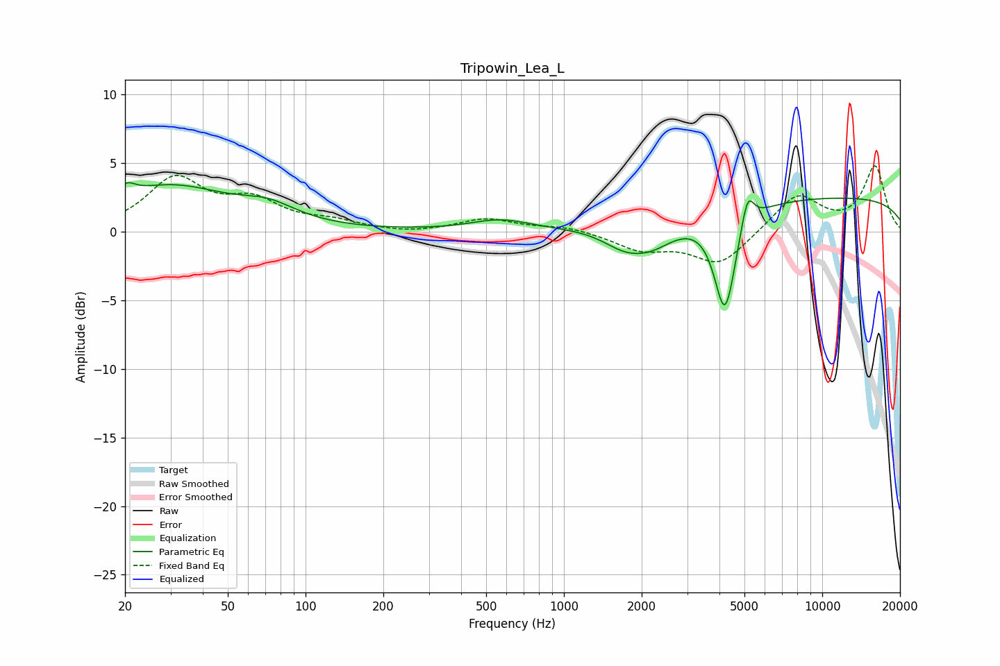

# Tripowin_Lea_L
See [usage instructions](https://github.com/jaakkopasanen/AutoEq#usage) for more options and info.

### Parametric EQs
Apply preamp of -3.6 dB when using parametric equalizer.

|   # | Type    |   Fc (Hz) |    Q |   Gain (dB) |
|-----|---------|-----------|------|-------------|
|   1 | Peaking |        20 | 5.48 |         3.3 |
|   2 | Peaking |        20 | 5.99 |        -2.4 |
|   3 | Peaking |        30 | 0.62 |         3.2 |
|   4 | Peaking |        72 | 1.31 |         1.1 |
|   5 | Peaking |       567 | 1.24 |         0.8 |
|   6 | Peaking |      1694 | 1.68 |        -1.1 |
|   7 | Peaking |      2166 | 1.39 |        -1.9 |
|   8 | Peaking |      4203 | 3.37 |        -7.4 |
|   9 | Peaking |      5139 | 5.77 |         2.4 |
|  10 | Peaking |     10000 | 0.18 |         2.5 |

### Fixed Band EQs
When using fixed band (also called graphic) equalizer, apply preamp of **-4.9 dB** (if available) and set gains manually with these parameters.

|   # | Type    |   Fc (Hz) |    Q |   Gain (dB) |
|-----|---------|-----------|------|-------------|
|   1 | Peaking |        31 | 1.41 |         3.7 |
|   2 | Peaking |        62 | 1.41 |         1.9 |
|   3 | Peaking |       125 | 1.41 |         0.6 |
|   4 | Peaking |       250 | 1.41 |        -0.2 |
|   5 | Peaking |       500 | 1.41 |         0.9 |
|   6 | Peaking |      1000 | 1.41 |         0.4 |
|   7 | Peaking |      2000 | 1.41 |        -1.2 |
|   8 | Peaking |      4000 | 1.41 |        -2.4 |
|   9 | Peaking |      8000 | 1.41 |         2.7 |
|  10 | Peaking |     16000 | 1.41 |         4.7 |

### Graphs

