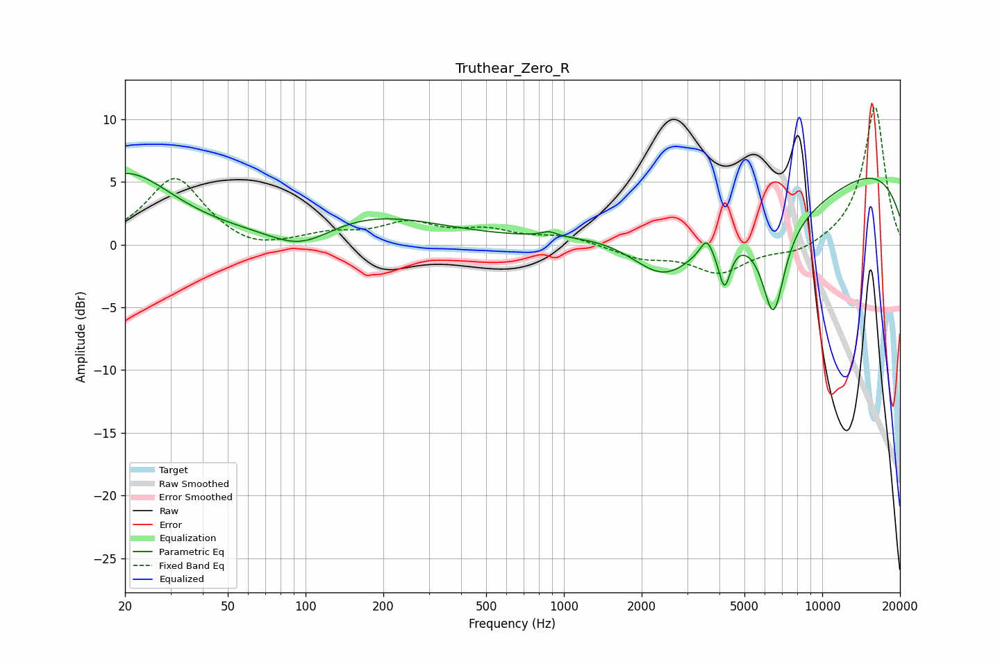

# Truthear_Zero_R
See [usage instructions](https://github.com/jaakkopasanen/AutoEq#usage) for more options and info.

### Parametric EQs
Apply preamp of -5.8 dB when using parametric equalizer.

|   # | Type    |   Fc (Hz) |    Q |   Gain (dB) |
|-----|---------|-----------|------|-------------|
|   1 | Peaking |        20 | 0.76 |         5.6 |
|   2 | Peaking |        96 | 1.09 |        -2.2 |
|   3 | Peaking |       162 | 0.47 |         2.5 |
|   4 | Peaking |       876 | 4.78 |         0.4 |
|   5 | Peaking |      2457 | 1.03 |        -4.7 |
|   6 | Peaking |      3567 | 5.99 |         1.3 |
|   7 | Peaking |      4184 | 6    |        -3.5 |
|   8 | Peaking |      6365 | 0.44 |        -4.6 |
|   9 | Peaking |      6474 | 3.09 |        -7.3 |
|  10 | Peaking |      9314 | 0.18 |         7.7 |

### Fixed Band EQs
When using fixed band (also called graphic) equalizer, apply preamp of **-11.1 dB** (if available) and set gains manually with these parameters.

|   # | Type    |   Fc (Hz) |    Q |   Gain (dB) |
|-----|---------|-----------|------|-------------|
|   1 | Peaking |        31 | 1.41 |         5.3 |
|   2 | Peaking |        62 | 1.41 |        -0.7 |
|   3 | Peaking |       125 | 1.41 |         0.7 |
|   4 | Peaking |       250 | 1.41 |         1.6 |
|   5 | Peaking |       500 | 1.41 |         1   |
|   6 | Peaking |      1000 | 1.41 |         0.7 |
|   7 | Peaking |      2000 | 1.41 |        -1   |
|   8 | Peaking |      4000 | 1.41 |        -2.2 |
|   9 | Peaking |      8000 | 1.41 |        -0.8 |
|  10 | Peaking |     16000 | 1.41 |        11.1 |

### Graphs

