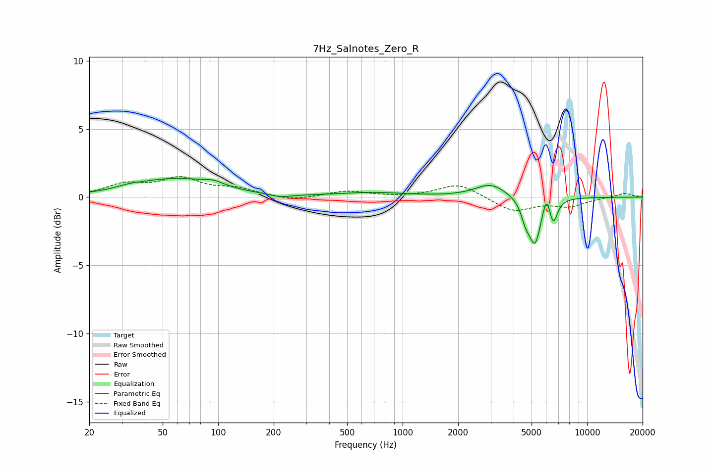

# 7Hz_Salnotes_Zero_R
See [usage instructions](https://github.com/jaakkopasanen/AutoEq#usage) for more options and info.

### Parametric EQs
Apply preamp of -1.5 dB when using parametric equalizer.

|   # | Type    |   Fc (Hz) |    Q |   Gain (dB) |
|-----|---------|-----------|------|-------------|
|   1 | Peaking |        33 | 1.86 |         0.2 |
|   2 | Peaking |        59 | 0.66 |         1.3 |
|   3 | Peaking |        95 | 2.62 |         0.3 |
|   4 | Peaking |       217 | 2.39 |        -0.2 |
|   5 | Peaking |       687 | 0.75 |         0.3 |
|   6 | Peaking |      3006 | 1.68 |         1   |
|   7 | Peaking |      4629 | 6    |        -1.1 |
|   8 | Peaking |      5220 | 4.22 |        -3.4 |
|   9 | Peaking |      6046 | 6    |         1.5 |
|  10 | Peaking |      6544 | 6    |        -1.9 |

### Fixed Band EQs
When using fixed band (also called graphic) equalizer, apply preamp of **-1.6 dB** (if available) and set gains manually with these parameters.

|   # | Type    |   Fc (Hz) |    Q |   Gain (dB) |
|-----|---------|-----------|------|-------------|
|   1 | Peaking |        31 | 1.41 |         0.9 |
|   2 | Peaking |        62 | 1.41 |         1.3 |
|   3 | Peaking |       125 | 1.41 |         0.5 |
|   4 | Peaking |       250 | 1.41 |        -0.3 |
|   5 | Peaking |       500 | 1.41 |         0.4 |
|   6 | Peaking |      1000 | 1.41 |        -0   |
|   7 | Peaking |      2000 | 1.41 |         1   |
|   8 | Peaking |      4000 | 1.41 |        -1   |
|   9 | Peaking |      8000 | 1.41 |        -0.6 |
|  10 | Peaking |     16000 | 1.41 |         0.3 |

### Graphs

