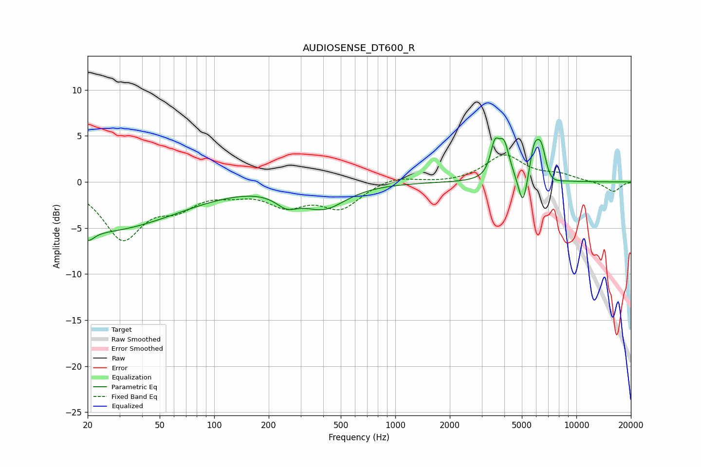

# AUDIOSENSE_DT600_R
See [usage instructions](https://github.com/jaakkopasanen/AutoEq#usage) for more options and info.

### Parametric EQs
Apply preamp of -4.9 dB when using parametric equalizer.

|   # | Type    |   Fc (Hz) |    Q |   Gain (dB) |
|-----|---------|-----------|------|-------------|
|   1 | Peaking |        20 | 4.42 |        -1   |
|   2 | Peaking |        22 | 0.31 |        -5.3 |
|   3 | Peaking |       251 | 2.3  |        -1.4 |
|   4 | Peaking |       404 | 1.16 |        -2.6 |
|   5 | Peaking |      3540 | 6    |         3.1 |
|   6 | Peaking |      3983 | 4.66 |         3.7 |
|   7 | Peaking |      5068 | 5.7  |        -3.6 |
|   8 | Peaking |      5830 | 5.82 |         2.5 |
|   9 | Peaking |      6385 | 4.03 |         4.6 |
|  10 | Peaking |      6952 | 2.94 |        -1.5 |

### Fixed Band EQs
When using fixed band (also called graphic) equalizer, apply preamp of **-3.0 dB** (if available) and set gains manually with these parameters.

|   # | Type    |   Fc (Hz) |    Q |   Gain (dB) |
|-----|---------|-----------|------|-------------|
|   1 | Peaking |        31 | 1.41 |        -5.9 |
|   2 | Peaking |        62 | 1.41 |        -2.2 |
|   3 | Peaking |       125 | 1.41 |        -0.8 |
|   4 | Peaking |       250 | 1.41 |        -2.3 |
|   5 | Peaking |       500 | 1.41 |        -2.7 |
|   6 | Peaking |      1000 | 1.41 |         0.7 |
|   7 | Peaking |      2000 | 1.41 |        -0.1 |
|   8 | Peaking |      4000 | 1.41 |         2.9 |
|   9 | Peaking |      8000 | 1.41 |         0.7 |
|  10 | Peaking |     16000 | 1.41 |        -1.1 |

### Graphs

