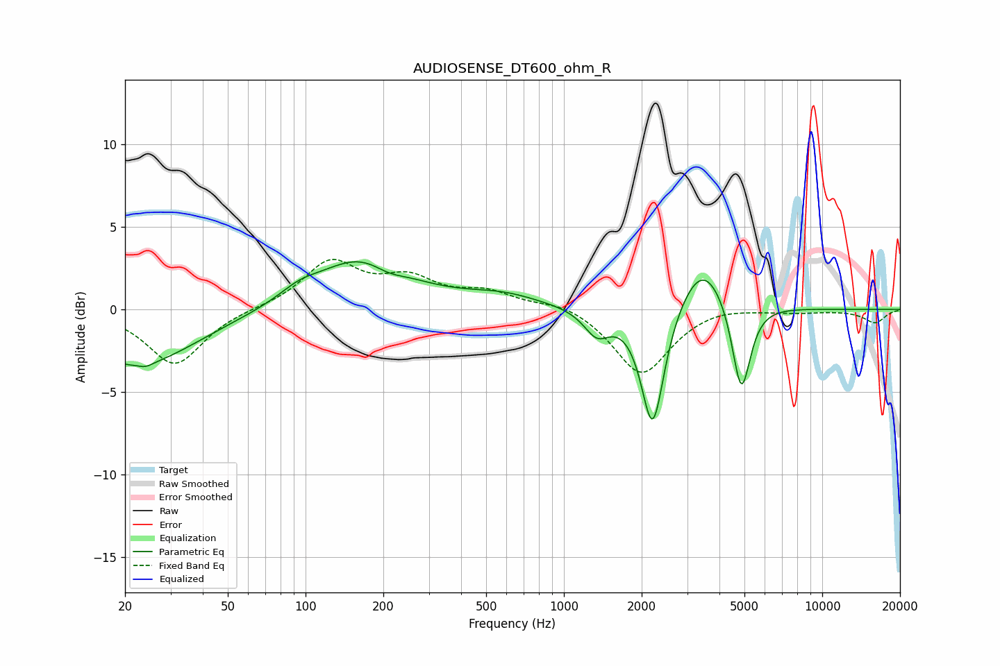

# AUDIOSENSE_DT600_ohm_R
See [usage instructions](https://github.com/jaakkopasanen/AutoEq#usage) for more options and info.

### Parametric EQs
Apply preamp of -3.0 dB when using parametric equalizer.

|   # | Type    |   Fc (Hz) |    Q |   Gain (dB) |
|-----|---------|-----------|------|-------------|
|   1 | Peaking |        22 | 0.61 |        -3.4 |
|   2 | Peaking |        24 | 5.75 |        -0.2 |
|   3 | Peaking |        94 | 1.81 |         0.6 |
|   4 | Peaking |       167 | 0.8  |         3.1 |
|   5 | Peaking |       209 | 2.09 |        -0.6 |
|   6 | Peaking |       578 | 0.95 |         0.7 |
|   7 | Peaking |      1342 | 2.84 |        -1.5 |
|   8 | Peaking |      2207 | 3.16 |        -7.5 |
|   9 | Peaking |      3444 | 1.53 |         3.2 |
|  10 | Peaking |      4860 | 3.92 |        -5.7 |

### Fixed Band EQs
When using fixed band (also called graphic) equalizer, apply preamp of **-3.1 dB** (if available) and set gains manually with these parameters.

|   # | Type    |   Fc (Hz) |    Q |   Gain (dB) |
|-----|---------|-----------|------|-------------|
|   1 | Peaking |        31 | 1.41 |        -3.4 |
|   2 | Peaking |        62 | 1.41 |         0.1 |
|   3 | Peaking |       125 | 1.41 |         2.8 |
|   4 | Peaking |       250 | 1.41 |         1.6 |
|   5 | Peaking |       500 | 1.41 |         0.9 |
|   6 | Peaking |      1000 | 1.41 |         0.5 |
|   7 | Peaking |      2000 | 1.41 |        -4   |
|   8 | Peaking |      4000 | 1.41 |         0.3 |
|   9 | Peaking |      8000 | 1.41 |        -0.1 |
|  10 | Peaking |     16000 | 1.41 |        -0.8 |

### Graphs

