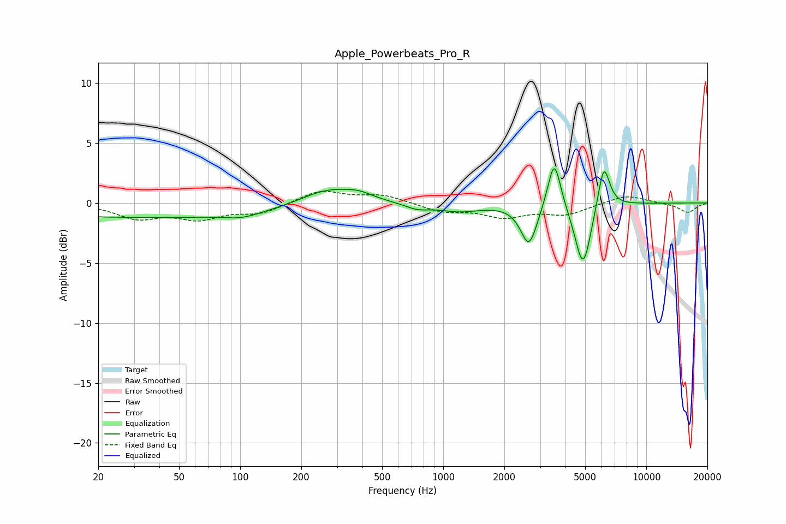

# Apple_Powerbeats_Pro_R
See [usage instructions](https://github.com/jaakkopasanen/AutoEq#usage) for more options and info.

### Parametric EQs
Apply preamp of -3.0 dB when using parametric equalizer.

|   # | Type    |   Fc (Hz) |    Q |   Gain (dB) |
|-----|---------|-----------|------|-------------|
|   1 | Peaking |        34 | 0.18 |        -1.2 |
|   2 | Peaking |       102 | 1.62 |        -0.4 |
|   3 | Peaking |       271 | 1.04 |         1.4 |
|   4 | Peaking |       386 | 2.1  |         0.5 |
|   5 | Peaking |       744 | 2.32 |        -0.5 |
|   6 | Peaking |      1205 | 1.35 |        -0.6 |
|   7 | Peaking |      2644 | 3.49 |        -3.5 |
|   8 | Peaking |      3522 | 4.41 |         4.3 |
|   9 | Peaking |      4883 | 3.49 |        -5.5 |
|  10 | Peaking |      6176 | 4.75 |         3.8 |

### Fixed Band EQs
When using fixed band (also called graphic) equalizer, apply preamp of **-1.1 dB** (if available) and set gains manually with these parameters.

|   # | Type    |   Fc (Hz) |    Q |   Gain (dB) |
|-----|---------|-----------|------|-------------|
|   1 | Peaking |        31 | 1.41 |        -1.2 |
|   2 | Peaking |        62 | 1.41 |        -1.2 |
|   3 | Peaking |       125 | 1.41 |        -0.8 |
|   4 | Peaking |       250 | 1.41 |         1.1 |
|   5 | Peaking |       500 | 1.41 |         0.7 |
|   6 | Peaking |      1000 | 1.41 |        -0.7 |
|   7 | Peaking |      2000 | 1.41 |        -1.1 |
|   8 | Peaking |      4000 | 1.41 |        -0.9 |
|   9 | Peaking |      8000 | 1.41 |         0.7 |
|  10 | Peaking |     16000 | 1.41 |        -0.8 |

### Graphs

