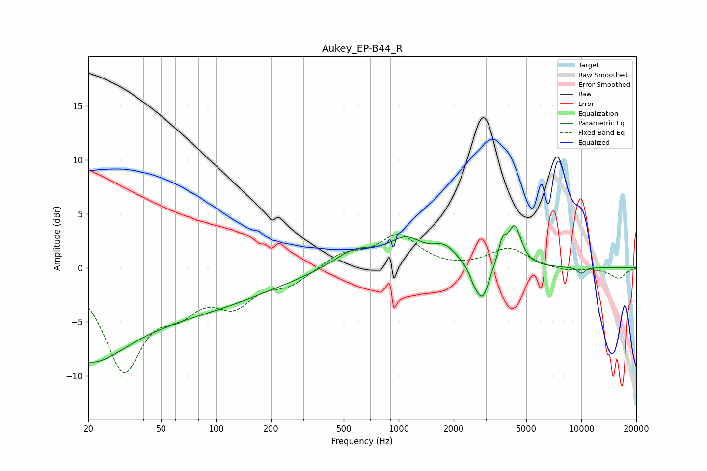

# Aukey_EP-B44_R
See [usage instructions](https://github.com/jaakkopasanen/AutoEq#usage) for more options and info.

### Parametric EQs
Apply preamp of -4.0 dB when using parametric equalizer.

|   # | Type    |   Fc (Hz) |    Q |   Gain (dB) |
|-----|---------|-----------|------|-------------|
|   1 | Peaking |        20 | 0.73 |        -4.5 |
|   2 | Peaking |        35 | 0.18 |        -4.4 |
|   3 | Peaking |       576 | 1.17 |         1.7 |
|   4 | Peaking |      1098 | 1.5  |         2.3 |
|   5 | Peaking |      1788 | 2.16 |         1.5 |
|   6 | Peaking |      2590 | 5.93 |        -0.9 |
|   7 | Peaking |      2883 | 4.02 |        -3.2 |
|   8 | Peaking |      3702 | 5.9  |         1.9 |
|   9 | Peaking |      4321 | 3.99 |         3.6 |
|  10 | Peaking |     10000 | 5.97 |        -0.6 |

### Fixed Band EQs
When using fixed band (also called graphic) equalizer, apply preamp of **-3.2 dB** (if available) and set gains manually with these parameters.

|   # | Type    |   Fc (Hz) |    Q |   Gain (dB) |
|-----|---------|-----------|------|-------------|
|   1 | Peaking |        31 | 1.41 |        -9.1 |
|   2 | Peaking |        62 | 1.41 |        -2.8 |
|   3 | Peaking |       125 | 1.41 |        -2.9 |
|   4 | Peaking |       250 | 1.41 |        -1.4 |
|   5 | Peaking |       500 | 1.41 |         1.3 |
|   6 | Peaking |      1000 | 1.41 |         2.9 |
|   7 | Peaking |      2000 | 1.41 |        -0.1 |
|   8 | Peaking |      4000 | 1.41 |         1.8 |
|   9 | Peaking |      8000 | 1.41 |        -0.3 |
|  10 | Peaking |     16000 | 1.41 |        -1   |

### Graphs

