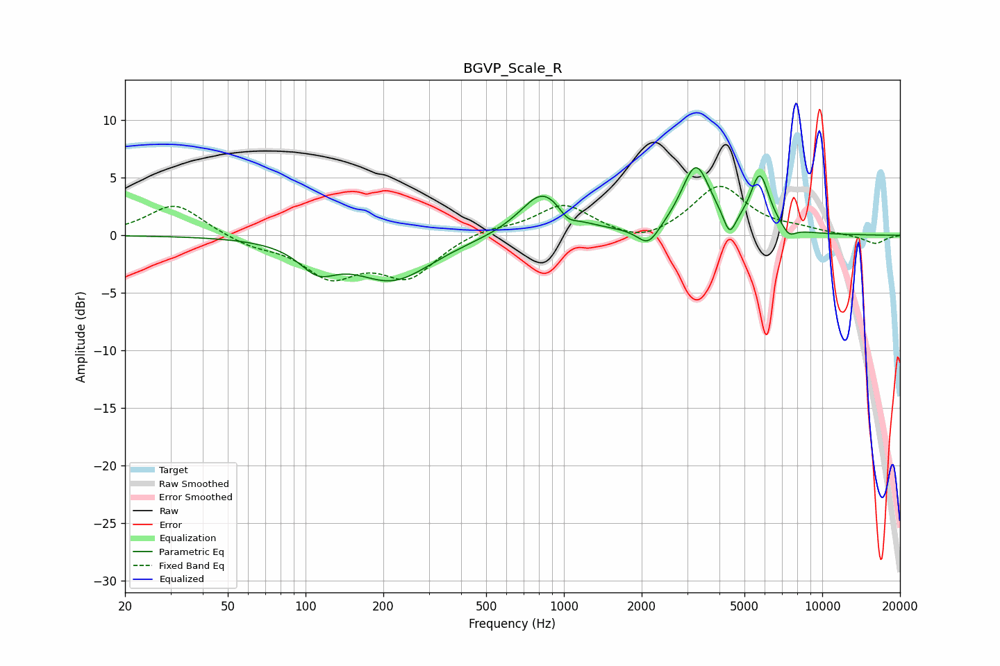

# BGVP_Scale_R
See [usage instructions](https://github.com/jaakkopasanen/AutoEq#usage) for more options and info.

### Parametric EQs
Apply preamp of -6.0 dB when using parametric equalizer.

|   # | Type    |   Fc (Hz) |    Q |   Gain (dB) |
|-----|---------|-----------|------|-------------|
|   1 | Peaking |       112 | 1.98 |        -2.2 |
|   2 | Peaking |       217 | 0.92 |        -3.8 |
|   3 | Peaking |       830 | 1.64 |         3.7 |
|   4 | Peaking |       870 | 1.18 |         0.2 |
|   5 | Peaking |      1033 | 3.99 |        -0.9 |
|   6 | Peaking |      2122 | 3.34 |        -1.7 |
|   7 | Peaking |      3242 | 2.49 |         5.9 |
|   8 | Peaking |      4380 | 5.99 |        -2   |
|   9 | Peaking |      5739 | 3.74 |         4.8 |
|  10 | Peaking |      7441 | 5.24 |        -0.8 |

### Fixed Band EQs
When using fixed band (also called graphic) equalizer, apply preamp of **-4.3 dB** (if available) and set gains manually with these parameters.

|   # | Type    |   Fc (Hz) |    Q |   Gain (dB) |
|-----|---------|-----------|------|-------------|
|   1 | Peaking |        31 | 1.41 |         2.8 |
|   2 | Peaking |        62 | 1.41 |        -0.8 |
|   3 | Peaking |       125 | 1.41 |        -3.3 |
|   4 | Peaking |       250 | 1.41 |        -3.4 |
|   5 | Peaking |       500 | 1.41 |         0.6 |
|   6 | Peaking |      1000 | 1.41 |         2.6 |
|   7 | Peaking |      2000 | 1.41 |        -1   |
|   8 | Peaking |      4000 | 1.41 |         4.3 |
|   9 | Peaking |      8000 | 1.41 |         0.4 |
|  10 | Peaking |     16000 | 1.41 |        -0.8 |

### Graphs

