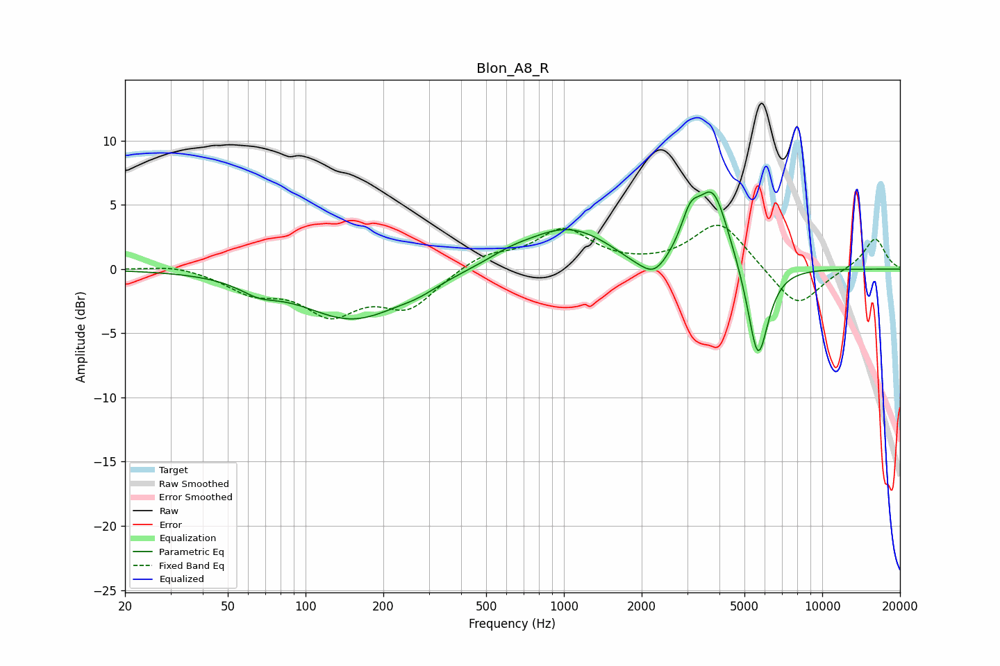

# Blon_A8_R
See [usage instructions](https://github.com/jaakkopasanen/AutoEq#usage) for more options and info.

### Parametric EQs
Apply preamp of -6.1 dB when using parametric equalizer.

|   # | Type    |   Fc (Hz) |    Q |   Gain (dB) |
|-----|---------|-----------|------|-------------|
|   1 | Peaking |        66 | 1.91 |        -0.9 |
|   2 | Peaking |       152 | 0.71 |        -3.9 |
|   3 | Peaking |       274 | 1.93 |        -0.4 |
|   4 | Peaking |       614 | 1.66 |         0.5 |
|   5 | Peaking |      1033 | 0.82 |         3.2 |
|   6 | Peaking |      1821 | 1.92 |        -0.5 |
|   7 | Peaking |      2235 | 2.58 |        -1.7 |
|   8 | Peaking |      3086 | 3.92 |         2.5 |
|   9 | Peaking |      3783 | 2.26 |         5.9 |
|  10 | Peaking |      5638 | 3.39 |        -7.7 |

### Fixed Band EQs
When using fixed band (also called graphic) equalizer, apply preamp of **-3.5 dB** (if available) and set gains manually with these parameters.

|   # | Type    |   Fc (Hz) |    Q |   Gain (dB) |
|-----|---------|-----------|------|-------------|
|   1 | Peaking |        31 | 1.41 |         0.4 |
|   2 | Peaking |        62 | 1.41 |        -1.6 |
|   3 | Peaking |       125 | 1.41 |        -3.1 |
|   4 | Peaking |       250 | 1.41 |        -2.8 |
|   5 | Peaking |       500 | 1.41 |         1.1 |
|   6 | Peaking |      1000 | 1.41 |         3   |
|   7 | Peaking |      2000 | 1.41 |         0.1 |
|   8 | Peaking |      4000 | 1.41 |         3.7 |
|   9 | Peaking |      8000 | 1.41 |        -3.1 |
|  10 | Peaking |     16000 | 1.41 |         2.5 |

### Graphs

