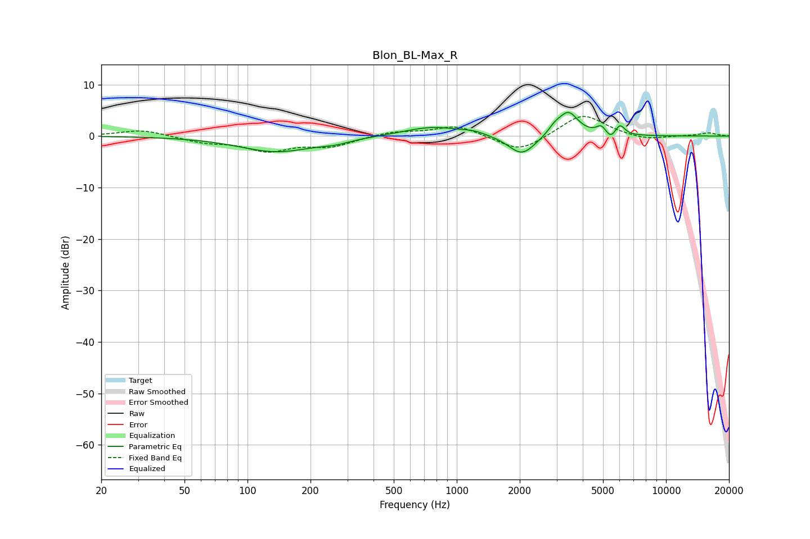

# Blon_BL-Max_R
See [usage instructions](https://github.com/jaakkopasanen/AutoEq#usage) for more options and info.

### Parametric EQs
Apply preamp of -4.7 dB when using parametric equalizer.

|   # | Type    |   Fc (Hz) |    Q |   Gain (dB) |
|-----|---------|-----------|------|-------------|
|   1 | Peaking |       138 | 0.79 |        -3   |
|   2 | Peaking |       263 | 2.03 |        -0.6 |
|   3 | Peaking |       763 | 1.03 |         1.9 |
|   4 | Peaking |      1209 | 2.32 |         0.6 |
|   5 | Peaking |      2049 | 2.19 |        -3.9 |
|   6 | Peaking |      2938 | 4.51 |         1.2 |
|   7 | Peaking |      3416 | 2.98 |         4.6 |
|   8 | Peaking |      4904 | 6    |         1.6 |
|   9 | Peaking |      5448 | 6    |        -1.3 |
|  10 | Peaking |      6023 | 6    |         2   |

### Fixed Band EQs
When using fixed band (also called graphic) equalizer, apply preamp of **-3.9 dB** (if available) and set gains manually with these parameters.

|   # | Type    |   Fc (Hz) |    Q |   Gain (dB) |
|-----|---------|-----------|------|-------------|
|   1 | Peaking |        31 | 1.41 |         1.3 |
|   2 | Peaking |        62 | 1.41 |        -1.1 |
|   3 | Peaking |       125 | 1.41 |        -2.7 |
|   4 | Peaking |       250 | 1.41 |        -1.9 |
|   5 | Peaking |       500 | 1.41 |         0.9 |
|   6 | Peaking |      1000 | 1.41 |         2.1 |
|   7 | Peaking |      2000 | 1.41 |        -3.3 |
|   8 | Peaking |      4000 | 1.41 |         4.4 |
|   9 | Peaking |      8000 | 1.41 |        -0.8 |
|  10 | Peaking |     16000 | 1.41 |         0.6 |

### Graphs

