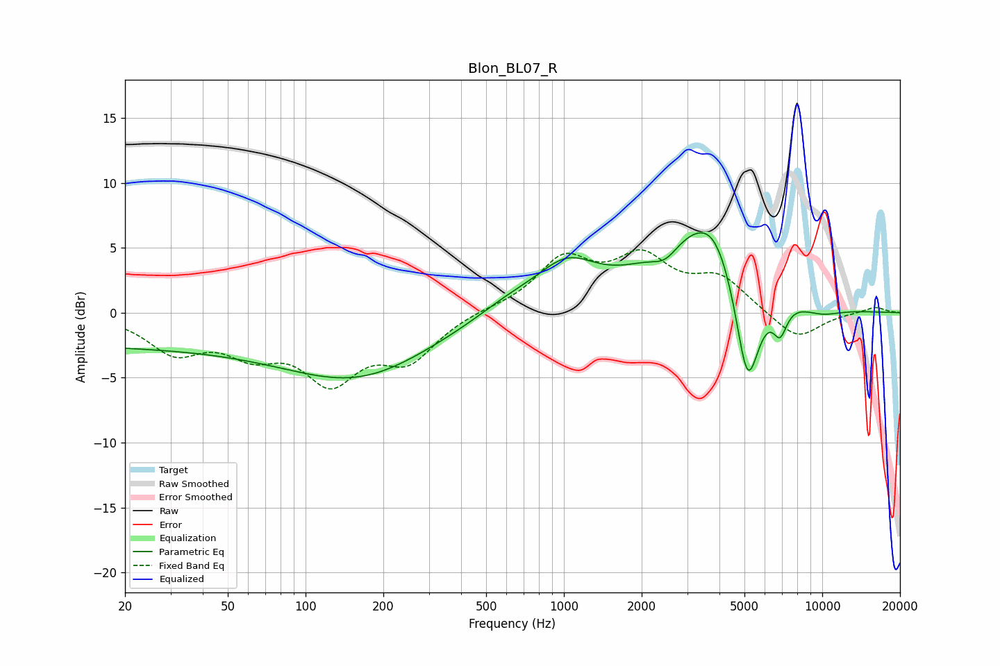

# Blon_BL07_R
See [usage instructions](https://github.com/jaakkopasanen/AutoEq#usage) for more options and info.

### Parametric EQs
Apply preamp of -6.2 dB when using parametric equalizer.

|   # | Type    |   Fc (Hz) |    Q |   Gain (dB) |
|-----|---------|-----------|------|-------------|
|   1 | Peaking |        20 | 0.18 |        -2.5 |
|   2 | Peaking |       165 | 0.5  |        -4.3 |
|   3 | Peaking |       620 | 1.05 |         1.1 |
|   4 | Peaking |      1025 | 1.23 |         3.1 |
|   5 | Peaking |      2468 | 2.68 |        -1.2 |
|   6 | Peaking |      3393 | 0.71 |         6.2 |
|   7 | Peaking |      3850 | 1.9  |         1.8 |
|   8 | Peaking |      5136 | 2.79 |        -9.2 |
|   9 | Peaking |      6867 | 4.92 |        -2.3 |
|  10 | Peaking |      9836 | 1.45 |        -0.7 |

### Fixed Band EQs
When using fixed band (also called graphic) equalizer, apply preamp of **-4.9 dB** (if available) and set gains manually with these parameters.

|   # | Type    |   Fc (Hz) |    Q |   Gain (dB) |
|-----|---------|-----------|------|-------------|
|   1 | Peaking |        31 | 1.41 |        -2.8 |
|   2 | Peaking |        62 | 1.41 |        -2.5 |
|   3 | Peaking |       125 | 1.41 |        -4.8 |
|   4 | Peaking |       250 | 1.41 |        -3.3 |
|   5 | Peaking |       500 | 1.41 |         0.2 |
|   6 | Peaking |      1000 | 1.41 |         3.9 |
|   7 | Peaking |      2000 | 1.41 |         3.8 |
|   8 | Peaking |      4000 | 1.41 |         2.5 |
|   9 | Peaking |      8000 | 1.41 |        -2.1 |
|  10 | Peaking |     16000 | 1.41 |         0.5 |

### Graphs

