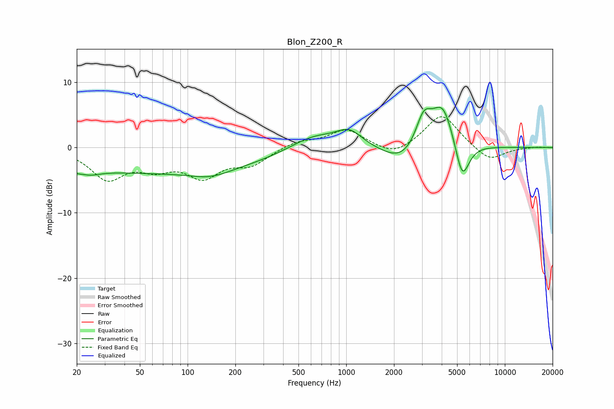

# Blon_Z200_R
See [usage instructions](https://github.com/jaakkopasanen/AutoEq#usage) for more options and info.

### Parametric EQs
Apply preamp of -6.3 dB when using parametric equalizer.

|   # | Type    |   Fc (Hz) |    Q |   Gain (dB) |
|-----|---------|-----------|------|-------------|
|   1 | Peaking |        20 | 5.86 |        -0.4 |
|   2 | Peaking |        24 | 2.02 |        -0.9 |
|   3 | Peaking |        65 | 0.18 |        -3.8 |
|   4 | Peaking |       139 | 1.17 |        -1.1 |
|   5 | Peaking |       627 | 0.9  |         2.3 |
|   6 | Peaking |      1048 | 1.77 |         2.3 |
|   7 | Peaking |      2267 | 1.16 |        -2.8 |
|   8 | Peaking |      3076 | 2.76 |         4.7 |
|   9 | Peaking |      4060 | 1.98 |         6.7 |
|  10 | Peaking |      5384 | 3.1  |        -6.2 |

### Fixed Band EQs
When using fixed band (also called graphic) equalizer, apply preamp of **-4.8 dB** (if available) and set gains manually with these parameters.

|   # | Type    |   Fc (Hz) |    Q |   Gain (dB) |
|-----|---------|-----------|------|-------------|
|   1 | Peaking |        31 | 1.41 |        -4.5 |
|   2 | Peaking |        62 | 1.41 |        -2.5 |
|   3 | Peaking |       125 | 1.41 |        -4   |
|   4 | Peaking |       250 | 1.41 |        -2.4 |
|   5 | Peaking |       500 | 1.41 |         1   |
|   6 | Peaking |      1000 | 1.41 |         2.7 |
|   7 | Peaking |      2000 | 1.41 |        -1.5 |
|   8 | Peaking |      4000 | 1.41 |         5.2 |
|   9 | Peaking |      8000 | 1.41 |        -2.2 |
|  10 | Peaking |     16000 | 1.41 |         0.1 |

### Graphs

