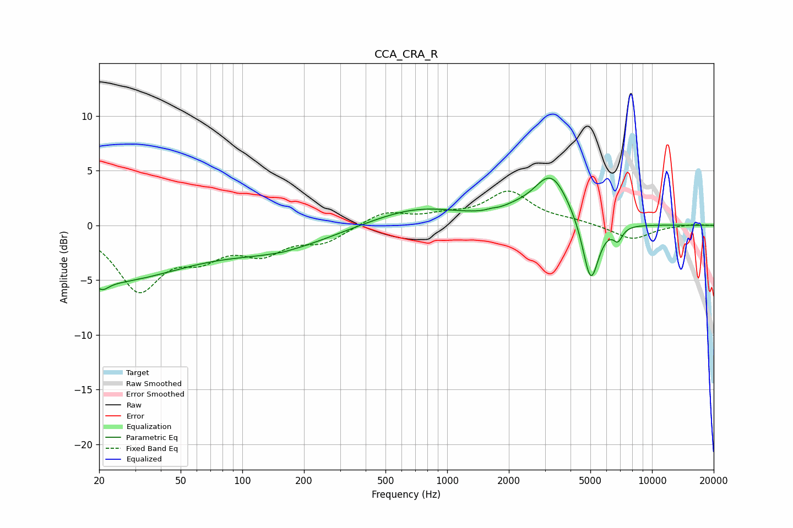

# CCA_CRA_R
See [usage instructions](https://github.com/jaakkopasanen/AutoEq#usage) for more options and info.

### Parametric EQs
Apply preamp of -4.4 dB when using parametric equalizer.

|   # | Type    |   Fc (Hz) |    Q |   Gain (dB) |
|-----|---------|-----------|------|-------------|
|   1 | Peaking |        20 | 0.34 |        -5.1 |
|   2 | Peaking |        21 | 4.83 |        -0.7 |
|   3 | Peaking |       150 | 0.56 |        -1.9 |
|   4 | Peaking |       158 | 5.99 |        -0   |
|   5 | Peaking |       715 | 0.64 |         1.6 |
|   6 | Peaking |      1646 | 6    |         0.1 |
|   7 | Peaking |      2119 | 1.96 |         0.4 |
|   8 | Peaking |      3222 | 1.58 |         4.5 |
|   9 | Peaking |      5020 | 3.49 |        -6   |
|  10 | Peaking |      6813 | 6    |        -1.2 |

### Fixed Band EQs
When using fixed band (also called graphic) equalizer, apply preamp of **-3.2 dB** (if available) and set gains manually with these parameters.

|   # | Type    |   Fc (Hz) |    Q |   Gain (dB) |
|-----|---------|-----------|------|-------------|
|   1 | Peaking |        31 | 1.41 |        -5.7 |
|   2 | Peaking |        62 | 1.41 |        -2.3 |
|   3 | Peaking |       125 | 1.41 |        -2.2 |
|   4 | Peaking |       250 | 1.41 |        -1.4 |
|   5 | Peaking |       500 | 1.41 |         1.2 |
|   6 | Peaking |      1000 | 1.41 |         0.7 |
|   7 | Peaking |      2000 | 1.41 |         3   |
|   8 | Peaking |      4000 | 1.41 |         0.3 |
|   9 | Peaking |      8000 | 1.41 |        -1.3 |
|  10 | Peaking |     16000 | 1.41 |         0.1 |

### Graphs

