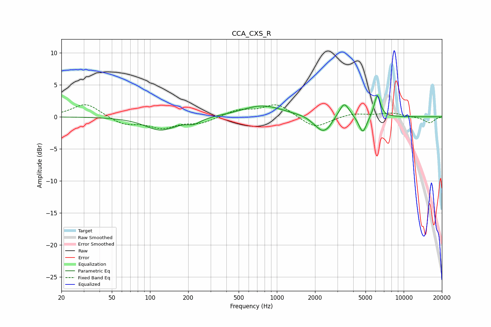

# CCA_CXS_R
See [usage instructions](https://github.com/jaakkopasanen/AutoEq#usage) for more options and info.

### Parametric EQs
Apply preamp of -3.4 dB when using parametric equalizer.

|   # | Type    |   Fc (Hz) |    Q |   Gain (dB) |
|-----|---------|-----------|------|-------------|
|   1 | Peaking |       121 | 1.18 |        -2.1 |
|   2 | Peaking |       222 | 2.68 |        -0.8 |
|   3 | Peaking |       769 | 0.88 |         1.8 |
|   4 | Peaking |      1939 | 3.83 |        -0.3 |
|   5 | Peaking |      2300 | 2.6  |        -2.3 |
|   6 | Peaking |      2576 | 5    |        -0.4 |
|   7 | Peaking |      3397 | 3.63 |         2.4 |
|   8 | Peaking |      4758 | 4.5  |        -2.7 |
|   9 | Peaking |      5990 | 5.32 |         0.5 |
|  10 | Peaking |      6219 | 5.99 |         3.2 |

### Fixed Band EQs
When using fixed band (also called graphic) equalizer, apply preamp of **-2.0 dB** (if available) and set gains manually with these parameters.

|   # | Type    |   Fc (Hz) |    Q |   Gain (dB) |
|-----|---------|-----------|------|-------------|
|   1 | Peaking |        31 | 1.41 |         2.1 |
|   2 | Peaking |        62 | 1.41 |        -1.2 |
|   3 | Peaking |       125 | 1.41 |        -1.6 |
|   4 | Peaking |       250 | 1.41 |        -0.9 |
|   5 | Peaking |       500 | 1.41 |         1   |
|   6 | Peaking |      1000 | 1.41 |         2   |
|   7 | Peaking |      2000 | 1.41 |        -1.8 |
|   8 | Peaking |      4000 | 1.41 |         0.6 |
|   9 | Peaking |      8000 | 1.41 |         0.6 |
|  10 | Peaking |     16000 | 1.41 |        -1   |

### Graphs

