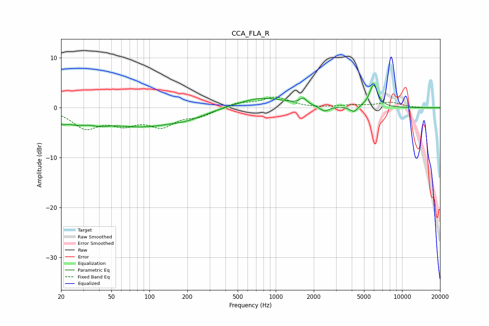

# CCA_FLA_R
See [usage instructions](https://github.com/jaakkopasanen/AutoEq#usage) for more options and info.

### Parametric EQs
Apply preamp of -4.6 dB when using parametric equalizer.

|   # | Type    |   Fc (Hz) |    Q |   Gain (dB) |
|-----|---------|-----------|------|-------------|
|   1 | Peaking |        20 | 5.46 |        -1.1 |
|   2 | Peaking |        26 | 1.48 |        -2   |
|   3 | Peaking |        41 | 2.32 |        -0.8 |
|   4 | Peaking |        84 | 0.46 |        -3.6 |
|   5 | Peaking |       204 | 1.05 |        -0.9 |
|   6 | Peaking |       779 | 0.73 |         2.1 |
|   7 | Peaking |      1652 | 5.19 |         1.2 |
|   8 | Peaking |      2434 | 3.95 |        -1.1 |
|   9 | Peaking |      4146 | 4.95 |        -1.2 |
|  10 | Peaking |      5951 | 4.2  |         4.5 |

### Fixed Band EQs
When using fixed band (also called graphic) equalizer, apply preamp of **-2.2 dB** (if available) and set gains manually with these parameters.

|   # | Type    |   Fc (Hz) |    Q |   Gain (dB) |
|-----|---------|-----------|------|-------------|
|   1 | Peaking |        31 | 1.41 |        -3.8 |
|   2 | Peaking |        62 | 1.41 |        -2.7 |
|   3 | Peaking |       125 | 1.41 |        -3.3 |
|   4 | Peaking |       250 | 1.41 |        -1.4 |
|   5 | Peaking |       500 | 1.41 |         1   |
|   6 | Peaking |      1000 | 1.41 |         2   |
|   7 | Peaking |      2000 | 1.41 |        -0.1 |
|   8 | Peaking |      4000 | 1.41 |         0.4 |
|   9 | Peaking |      8000 | 1.41 |         1   |
|  10 | Peaking |     16000 | 1.41 |        -0.1 |

### Graphs

