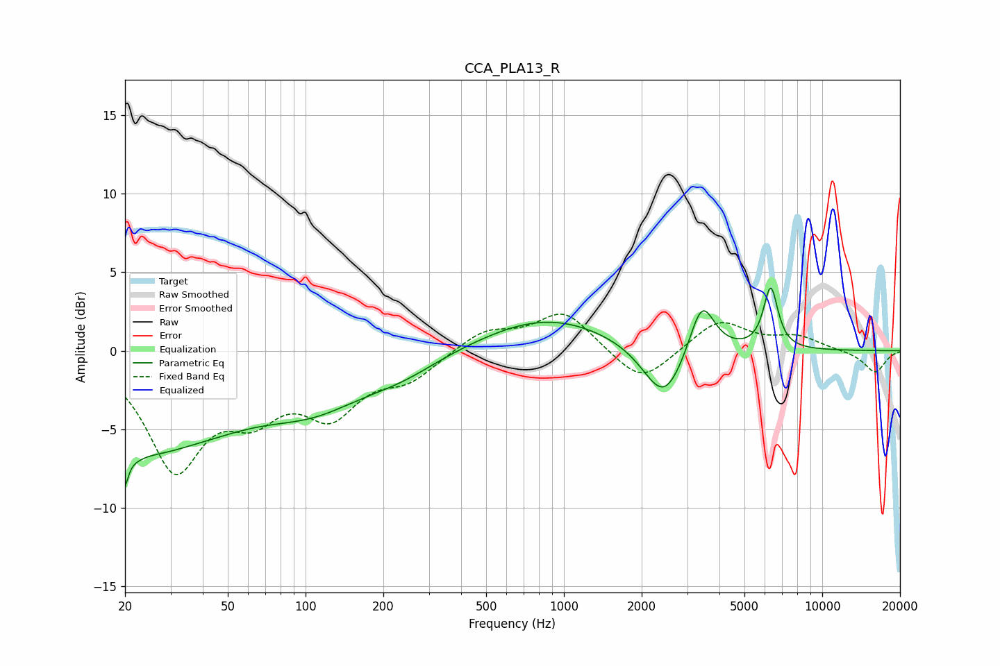

# CCA_PLA13_R
See [usage instructions](https://github.com/jaakkopasanen/AutoEq#usage) for more options and info.

### Parametric EQs
Apply preamp of -4.1 dB when using parametric equalizer.

|   # | Type    |   Fc (Hz) |    Q |   Gain (dB) |
|-----|---------|-----------|------|-------------|
|   1 | Peaking |        20 | 5.05 |        -6.1 |
|   2 | Peaking |        20 | 5.76 |         3.3 |
|   3 | Peaking |        28 | 0.48 |        -6.4 |
|   4 | Peaking |        35 | 1.02 |         0.6 |
|   5 | Peaking |       109 | 0.7  |        -2.5 |
|   6 | Peaking |       235 | 0.93 |        -1   |
|   7 | Peaking |       860 | 0.56 |         2.2 |
|   8 | Peaking |      2440 | 1.77 |        -3.7 |
|   9 | Peaking |      3420 | 2.91 |         3.5 |
|  10 | Peaking |      6318 | 4.95 |         3.9 |

### Fixed Band EQs
When using fixed band (also called graphic) equalizer, apply preamp of **-2.4 dB** (if available) and set gains manually with these parameters.

|   # | Type    |   Fc (Hz) |    Q |   Gain (dB) |
|-----|---------|-----------|------|-------------|
|   1 | Peaking |        31 | 1.41 |        -7.2 |
|   2 | Peaking |        62 | 1.41 |        -3.1 |
|   3 | Peaking |       125 | 1.41 |        -3.6 |
|   4 | Peaking |       250 | 1.41 |        -1.6 |
|   5 | Peaking |       500 | 1.41 |         1.3 |
|   6 | Peaking |      1000 | 1.41 |         2.5 |
|   7 | Peaking |      2000 | 1.41 |        -2.2 |
|   8 | Peaking |      4000 | 1.41 |         2   |
|   9 | Peaking |      8000 | 1.41 |         0.8 |
|  10 | Peaking |     16000 | 1.41 |        -1.4 |

### Graphs

