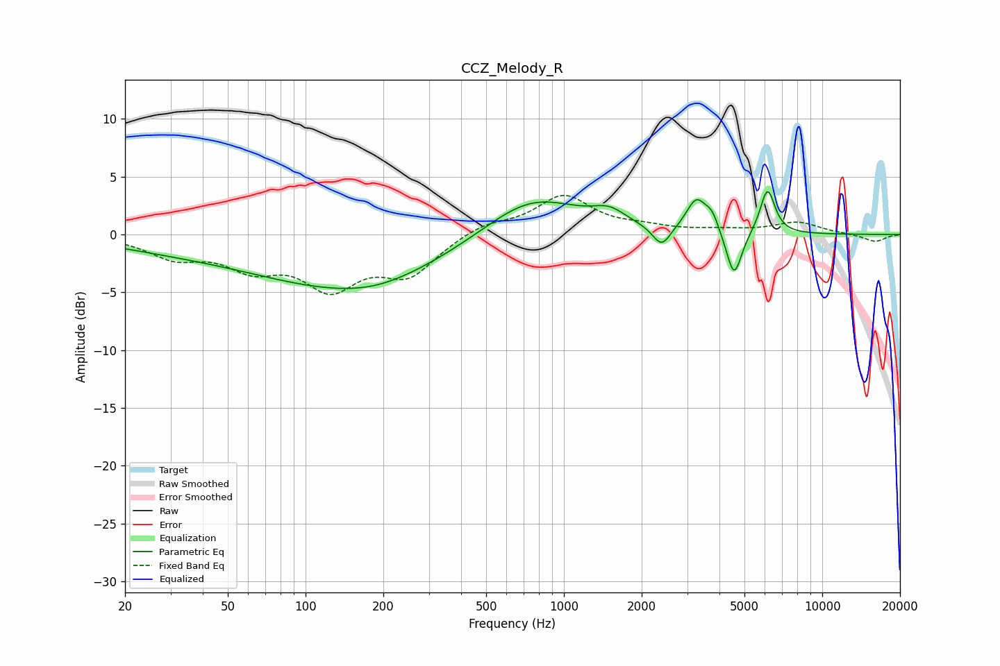

# CCZ_Melody_R
See [usage instructions](https://github.com/jaakkopasanen/AutoEq#usage) for more options and info.

### Parametric EQs
Apply preamp of -3.8 dB when using parametric equalizer.

|   # | Type    |   Fc (Hz) |    Q |   Gain (dB) |
|-----|---------|-----------|------|-------------|
|   1 | Peaking |        30 | 0.54 |        -0.8 |
|   2 | Peaking |       145 | 0.37 |        -4.4 |
|   3 | Peaking |       186 | 0.91 |        -0.5 |
|   4 | Peaking |       751 | 0.76 |         3.6 |
|   5 | Peaking |      1500 | 2.18 |         1.2 |
|   6 | Peaking |      2390 | 4.04 |        -1.8 |
|   7 | Peaking |      3258 | 3.58 |         2.8 |
|   8 | Peaking |      3747 | 5.4  |         1.3 |
|   9 | Peaking |      4558 | 4.69 |        -4.1 |
|  10 | Peaking |      6140 | 4.85 |         3.9 |

### Fixed Band EQs
When using fixed band (also called graphic) equalizer, apply preamp of **-3.5 dB** (if available) and set gains manually with these parameters.

|   # | Type    |   Fc (Hz) |    Q |   Gain (dB) |
|-----|---------|-----------|------|-------------|
|   1 | Peaking |        31 | 1.41 |        -1.8 |
|   2 | Peaking |        62 | 1.41 |        -2.4 |
|   3 | Peaking |       125 | 1.41 |        -4.2 |
|   4 | Peaking |       250 | 1.41 |        -3.2 |
|   5 | Peaking |       500 | 1.41 |         0.9 |
|   6 | Peaking |      1000 | 1.41 |         3.3 |
|   7 | Peaking |      2000 | 1.41 |         0.5 |
|   8 | Peaking |      4000 | 1.41 |         0.3 |
|   9 | Peaking |      8000 | 1.41 |         1   |
|  10 | Peaking |     16000 | 1.41 |        -0.6 |

### Graphs

