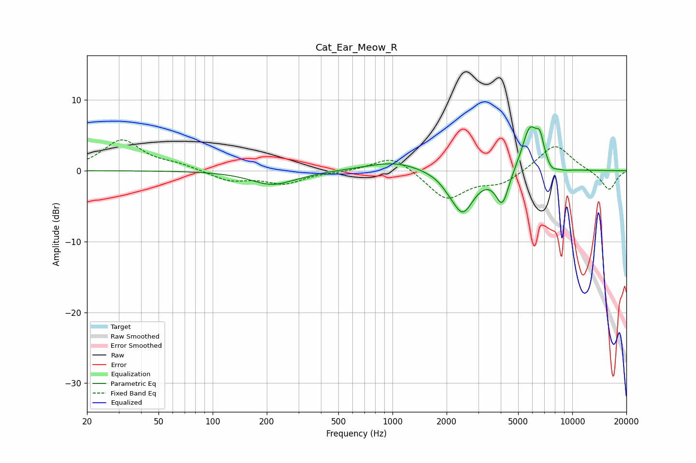

# Cat_Ear_Meow_R
See [usage instructions](https://github.com/jaakkopasanen/AutoEq#usage) for more options and info.

### Parametric EQs
Apply preamp of -6.3 dB when using parametric equalizer.

|   # | Type    |   Fc (Hz) |    Q |   Gain (dB) |
|-----|---------|-----------|------|-------------|
|   1 | Peaking |       214 | 1.18 |        -1.9 |
|   2 | Peaking |       318 | 2.08 |        -0.1 |
|   3 | Peaking |      1024 | 0.94 |         1.3 |
|   4 | Peaking |      2030 | 3.5  |        -0.4 |
|   5 | Peaking |      2453 | 2.24 |        -5.9 |
|   6 | Peaking |      4083 | 3.84 |        -4.7 |
|   7 | Peaking |      5805 | 3.03 |         6.2 |
|   8 | Peaking |      6620 | 6    |         3   |
|   9 | Peaking |      7654 | 4.54 |        -0.9 |
|  10 | Peaking |      9080 | 3.49 |        -0.2 |

### Fixed Band EQs
When using fixed band (also called graphic) equalizer, apply preamp of **-4.4 dB** (if available) and set gains manually with these parameters.

|   # | Type    |   Fc (Hz) |    Q |   Gain (dB) |
|-----|---------|-----------|------|-------------|
|   1 | Peaking |        31 | 1.41 |         4.3 |
|   2 | Peaking |        62 | 1.41 |         0.7 |
|   3 | Peaking |       125 | 1.41 |        -1.4 |
|   4 | Peaking |       250 | 1.41 |        -1.7 |
|   5 | Peaking |       500 | 1.41 |        -0.1 |
|   6 | Peaking |      1000 | 1.41 |         2.3 |
|   7 | Peaking |      2000 | 1.41 |        -4   |
|   8 | Peaking |      4000 | 1.41 |        -1.7 |
|   9 | Peaking |      8000 | 1.41 |         3.9 |
|  10 | Peaking |     16000 | 1.41 |        -2.8 |

### Graphs

