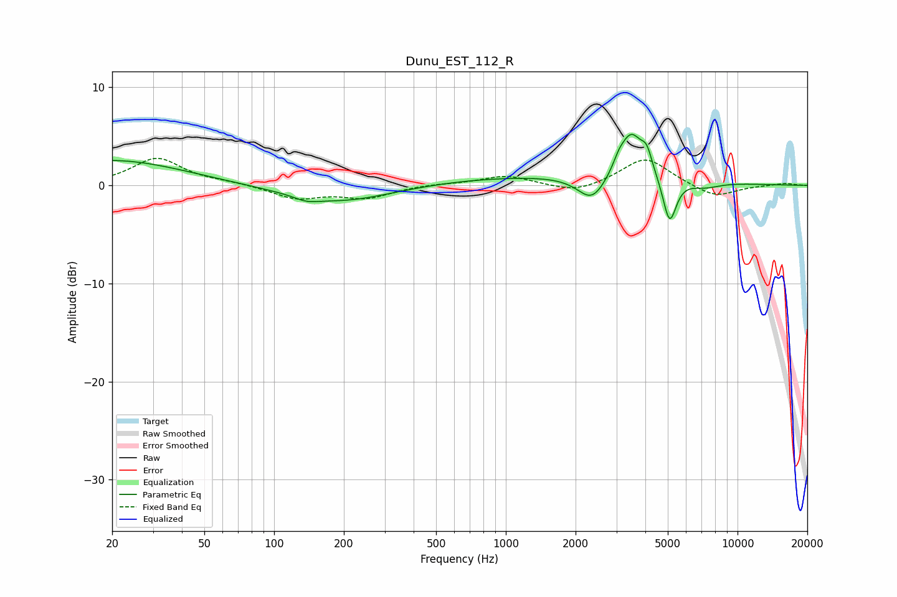

# Dunu_EST_112_R
See [usage instructions](https://github.com/jaakkopasanen/AutoEq#usage) for more options and info.

### Parametric EQs
Apply preamp of -5.3 dB when using parametric equalizer.

|   # | Type    |   Fc (Hz) |    Q |   Gain (dB) |
|-----|---------|-----------|------|-------------|
|   1 | Peaking |        20 | 0.46 |         2.6 |
|   2 | Peaking |       138 | 2.91 |        -0.4 |
|   3 | Peaking |       190 | 0.62 |        -1.8 |
|   4 | Peaking |      1701 | 0.24 |         1   |
|   5 | Peaking |      2357 | 2.28 |        -2.7 |
|   6 | Peaking |      3069 | 5.99 |         0.8 |
|   7 | Peaking |      3471 | 2.8  |         4.6 |
|   8 | Peaking |      4058 | 5.94 |         1.9 |
|   9 | Peaking |      5092 | 4.85 |        -4.7 |
|  10 | Peaking |      7229 | 2.09 |        -0.6 |

### Fixed Band EQs
When using fixed band (also called graphic) equalizer, apply preamp of **-2.8 dB** (if available) and set gains manually with these parameters.

|   # | Type    |   Fc (Hz) |    Q |   Gain (dB) |
|-----|---------|-----------|------|-------------|
|   1 | Peaking |        31 | 1.41 |         2.8 |
|   2 | Peaking |        62 | 1.41 |         0.2 |
|   3 | Peaking |       125 | 1.41 |        -1.3 |
|   4 | Peaking |       250 | 1.41 |        -1.2 |
|   5 | Peaking |       500 | 1.41 |         0.1 |
|   6 | Peaking |      1000 | 1.41 |         1   |
|   7 | Peaking |      2000 | 1.41 |        -0.9 |
|   8 | Peaking |      4000 | 1.41 |         2.9 |
|   9 | Peaking |      8000 | 1.41 |        -1.3 |
|  10 | Peaking |     16000 | 1.41 |         0.2 |

### Graphs

