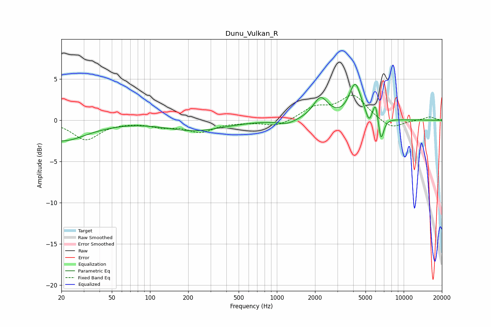

# Dunu_Vulkan_R
See [usage instructions](https://github.com/jaakkopasanen/AutoEq#usage) for more options and info.

### Parametric EQs
Apply preamp of -4.5 dB when using parametric equalizer.

|   # | Type    |   Fc (Hz) |    Q |   Gain (dB) |
|-----|---------|-----------|------|-------------|
|   1 | Peaking |        20 | 0.72 |        -2.5 |
|   2 | Peaking |        46 | 2.32 |        -0   |
|   3 | Peaking |       225 | 0.62 |        -1.2 |
|   4 | Peaking |      1201 | 2.15 |        -0.5 |
|   5 | Peaking |      2211 | 2.41 |         2.6 |
|   6 | Peaking |      3852 | 3.65 |         0.3 |
|   7 | Peaking |      4164 | 3.04 |         4.1 |
|   8 | Peaking |      5334 | 6    |        -1.3 |
|   9 | Peaking |      6007 | 6    |         2.4 |
|  10 | Peaking |      6603 | 6    |        -3.2 |

### Fixed Band EQs
When using fixed band (also called graphic) equalizer, apply preamp of **-3.1 dB** (if available) and set gains manually with these parameters.

|   # | Type    |   Fc (Hz) |    Q |   Gain (dB) |
|-----|---------|-----------|------|-------------|
|   1 | Peaking |        31 | 1.41 |        -2.3 |
|   2 | Peaking |        62 | 1.41 |        -0.1 |
|   3 | Peaking |       125 | 1.41 |        -0.7 |
|   4 | Peaking |       250 | 1.41 |        -1.3 |
|   5 | Peaking |       500 | 1.41 |        -0.1 |
|   6 | Peaking |      1000 | 1.41 |        -0.8 |
|   7 | Peaking |      2000 | 1.41 |         1.4 |
|   8 | Peaking |      4000 | 1.41 |         3   |
|   9 | Peaking |      8000 | 1.41 |        -1.1 |
|  10 | Peaking |     16000 | 1.41 |         0.4 |

### Graphs

