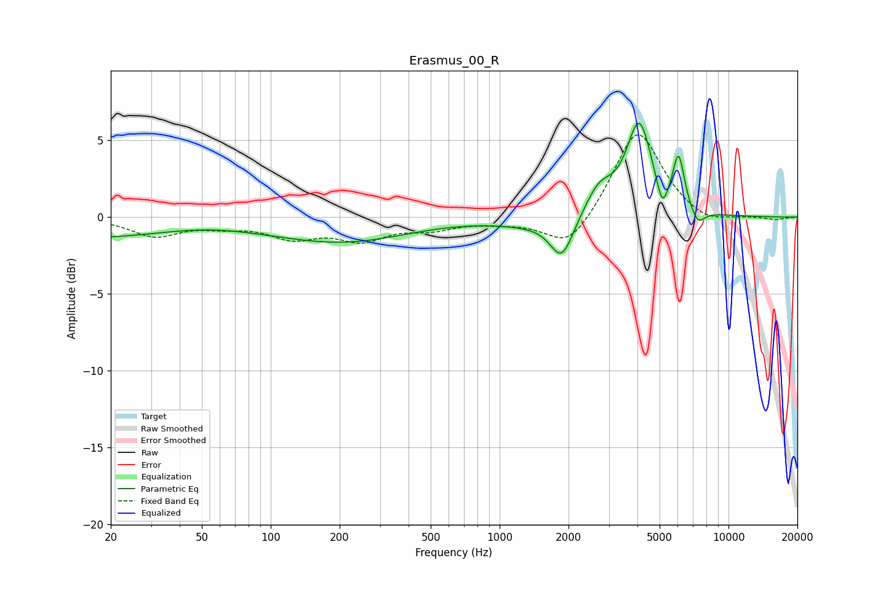

# Erasmus_00_R
See [usage instructions](https://github.com/jaakkopasanen/AutoEq#usage) for more options and info.

### Parametric EQs
Apply preamp of -6.2 dB when using parametric equalizer.

|   # | Type    |   Fc (Hz) |    Q |   Gain (dB) |
|-----|---------|-----------|------|-------------|
|   1 | Peaking |        28 | 0.19 |        -1.6 |
|   2 | Peaking |        54 | 0.55 |         0.9 |
|   3 | Peaking |       229 | 0.53 |        -1.2 |
|   4 | Peaking |      1351 | 0.96 |        -0.4 |
|   5 | Peaking |      1870 | 2.78 |        -2.7 |
|   6 | Peaking |      2726 | 2.27 |         1.8 |
|   7 | Peaking |      4073 | 2.52 |         6   |
|   8 | Peaking |      5133 | 5.98 |        -1.7 |
|   9 | Peaking |      6052 | 5.55 |         3.4 |
|  10 | Peaking |      7340 | 4.43 |        -1   |

### Fixed Band EQs
When using fixed band (also called graphic) equalizer, apply preamp of **-5.5 dB** (if available) and set gains manually with these parameters.

|   # | Type    |   Fc (Hz) |    Q |   Gain (dB) |
|-----|---------|-----------|------|-------------|
|   1 | Peaking |        31 | 1.41 |        -1.2 |
|   2 | Peaking |        62 | 1.41 |        -0.4 |
|   3 | Peaking |       125 | 1.41 |        -1.2 |
|   4 | Peaking |       250 | 1.41 |        -1.3 |
|   5 | Peaking |       500 | 1.41 |        -0.6 |
|   6 | Peaking |      1000 | 1.41 |        -0.2 |
|   7 | Peaking |      2000 | 1.41 |        -2.2 |
|   8 | Peaking |      4000 | 1.41 |         5.8 |
|   9 | Peaking |      8000 | 1.41 |        -0.6 |
|  10 | Peaking |     16000 | 1.41 |        -0.2 |

### Graphs

