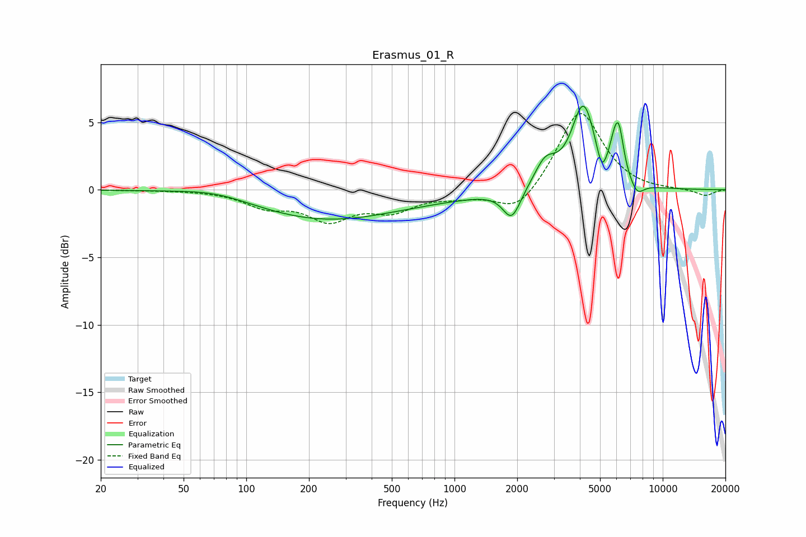

# Erasmus_01_R
See [usage instructions](https://github.com/jaakkopasanen/AutoEq#usage) for more options and info.

### Parametric EQs
Apply preamp of -6.3 dB when using parametric equalizer.

|   # | Type    |   Fc (Hz) |    Q |   Gain (dB) |
|-----|---------|-----------|------|-------------|
|   1 | Peaking |        73 | 0.83 |         0.6 |
|   2 | Peaking |       236 | 0.4  |        -2.2 |
|   3 | Peaking |       938 | 0.58 |        -0.3 |
|   4 | Peaking |      1884 | 3.32 |        -2.2 |
|   5 | Peaking |      2728 | 2.72 |         1.8 |
|   6 | Peaking |      4163 | 2.43 |         6.1 |
|   7 | Peaking |      5090 | 6    |        -1.6 |
|   8 | Peaking |      5819 | 5.99 |         1.3 |
|   9 | Peaking |      6154 | 5.72 |         3.3 |
|  10 | Peaking |      7531 | 4.06 |        -1   |

### Fixed Band EQs
When using fixed band (also called graphic) equalizer, apply preamp of **-5.7 dB** (if available) and set gains manually with these parameters.

|   # | Type    |   Fc (Hz) |    Q |   Gain (dB) |
|-----|---------|-----------|------|-------------|
|   1 | Peaking |        31 | 1.41 |        -0   |
|   2 | Peaking |        62 | 1.41 |        -0   |
|   3 | Peaking |       125 | 1.41 |        -1.1 |
|   4 | Peaking |       250 | 1.41 |        -2   |
|   5 | Peaking |       500 | 1.41 |        -1.4 |
|   6 | Peaking |      1000 | 1.41 |        -0.4 |
|   7 | Peaking |      2000 | 1.41 |        -1.8 |
|   8 | Peaking |      4000 | 1.41 |         6   |
|   9 | Peaking |      8000 | 1.41 |        -0.1 |
|  10 | Peaking |     16000 | 1.41 |        -0.5 |

### Graphs

