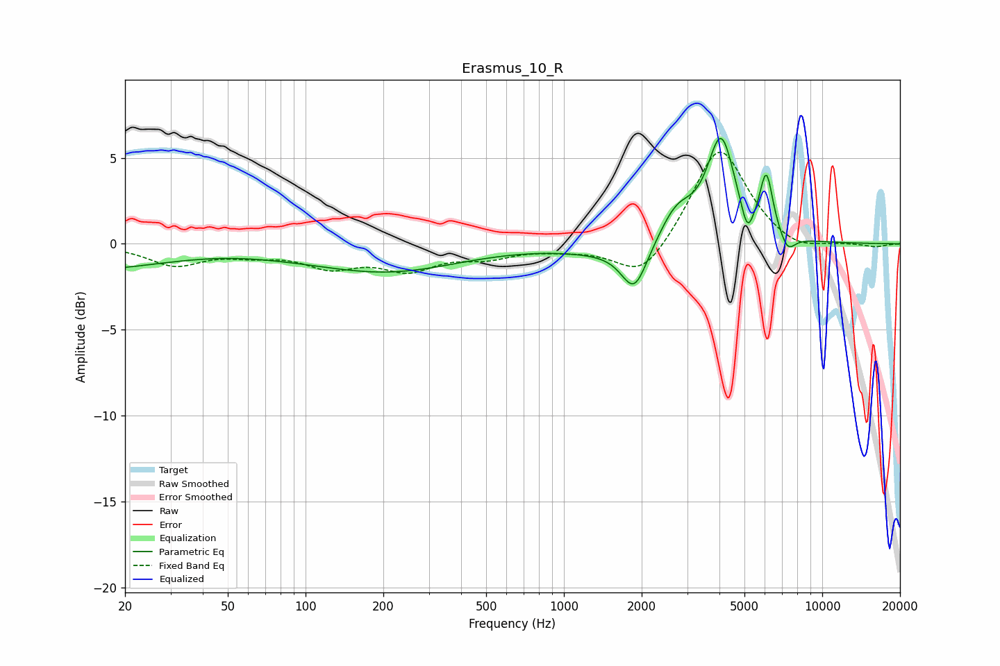

# Erasmus_10_R
See [usage instructions](https://github.com/jaakkopasanen/AutoEq#usage) for more options and info.

### Parametric EQs
Apply preamp of -6.2 dB when using parametric equalizer.

|   # | Type    |   Fc (Hz) |    Q |   Gain (dB) |
|-----|---------|-----------|------|-------------|
|   1 | Peaking |        20 | 0.19 |        -1.9 |
|   2 | Peaking |        47 | 0.48 |         1   |
|   3 | Peaking |       217 | 0.52 |        -1.4 |
|   4 | Peaking |      1397 | 0.88 |        -0.4 |
|   5 | Peaking |      1876 | 2.77 |        -2.7 |
|   6 | Peaking |      2734 | 2.11 |         1.9 |
|   7 | Peaking |      4059 | 2.62 |         5.9 |
|   8 | Peaking |      5129 | 6    |        -1.6 |
|   9 | Peaking |      6077 | 5.44 |         3.5 |
|  10 | Peaking |      7347 | 4.56 |        -1   |

### Fixed Band EQs
When using fixed band (also called graphic) equalizer, apply preamp of **-5.4 dB** (if available) and set gains manually with these parameters.

|   # | Type    |   Fc (Hz) |    Q |   Gain (dB) |
|-----|---------|-----------|------|-------------|
|   1 | Peaking |        31 | 1.41 |        -1.2 |
|   2 | Peaking |        62 | 1.41 |        -0.5 |
|   3 | Peaking |       125 | 1.41 |        -1.2 |
|   4 | Peaking |       250 | 1.41 |        -1.3 |
|   5 | Peaking |       500 | 1.41 |        -0.7 |
|   6 | Peaking |      1000 | 1.41 |        -0.2 |
|   7 | Peaking |      2000 | 1.41 |        -2.2 |
|   8 | Peaking |      4000 | 1.41 |         5.8 |
|   9 | Peaking |      8000 | 1.41 |        -0.6 |
|  10 | Peaking |     16000 | 1.41 |        -0.2 |

### Graphs

