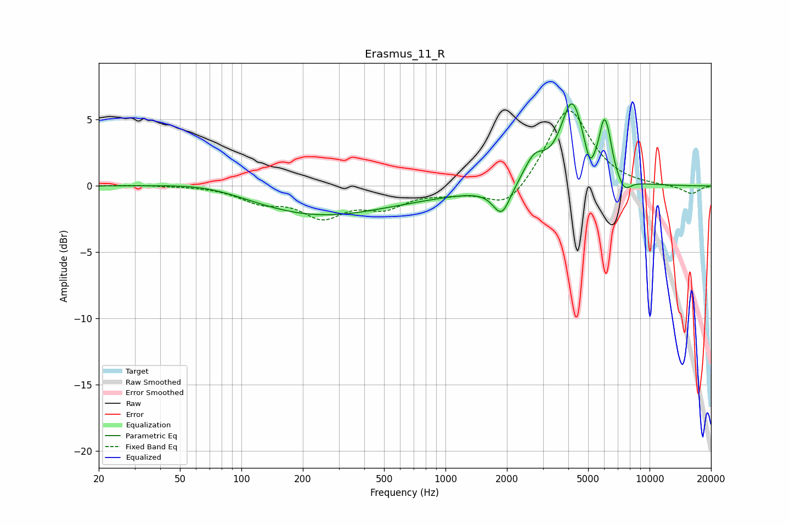

# Erasmus_11_R
See [usage instructions](https://github.com/jaakkopasanen/AutoEq#usage) for more options and info.

### Parametric EQs
Apply preamp of -6.3 dB when using parametric equalizer.

|   # | Type    |   Fc (Hz) |    Q |   Gain (dB) |
|-----|---------|-----------|------|-------------|
|   1 | Peaking |        70 | 0.7  |         0.6 |
|   2 | Peaking |       232 | 0.42 |        -2.2 |
|   3 | Peaking |       873 | 0.51 |        -0.3 |
|   4 | Peaking |      1887 | 3.3  |        -2.2 |
|   5 | Peaking |      2724 | 2.7  |         1.8 |
|   6 | Peaking |      4176 | 2.43 |         6.1 |
|   7 | Peaking |      5090 | 6    |        -1.5 |
|   8 | Peaking |      5978 | 5.71 |         3.3 |
|   9 | Peaking |      6321 | 5.98 |         1.3 |
|  10 | Peaking |      7521 | 4.04 |        -1   |

### Fixed Band EQs
When using fixed band (also called graphic) equalizer, apply preamp of **-5.8 dB** (if available) and set gains manually with these parameters.

|   # | Type    |   Fc (Hz) |    Q |   Gain (dB) |
|-----|---------|-----------|------|-------------|
|   1 | Peaking |        31 | 1.41 |         0.1 |
|   2 | Peaking |        62 | 1.41 |         0   |
|   3 | Peaking |       125 | 1.41 |        -1   |
|   4 | Peaking |       250 | 1.41 |        -2.1 |
|   5 | Peaking |       500 | 1.41 |        -1.4 |
|   6 | Peaking |      1000 | 1.41 |        -0.4 |
|   7 | Peaking |      2000 | 1.41 |        -1.9 |
|   8 | Peaking |      4000 | 1.41 |         6   |
|   9 | Peaking |      8000 | 1.41 |        -0   |
|  10 | Peaking |     16000 | 1.41 |        -0.6 |

### Graphs

