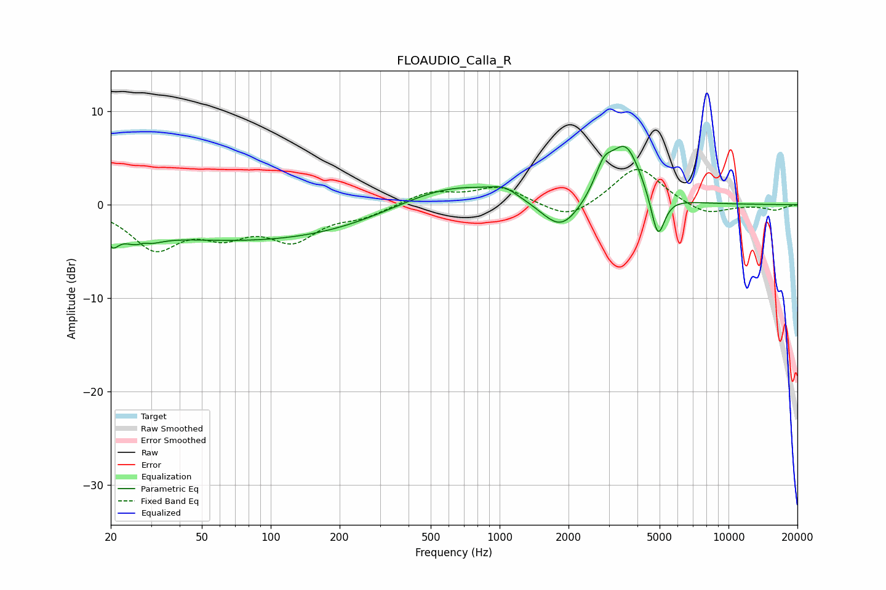

# FLOAUDIO_Calla_R
See [usage instructions](https://github.com/jaakkopasanen/AutoEq#usage) for more options and info.

### Parametric EQs
Apply preamp of -6.3 dB when using parametric equalizer.

|   # | Type    |   Fc (Hz) |    Q |   Gain (dB) |
|-----|---------|-----------|------|-------------|
|   1 | Peaking |        20 | 5.27 |        -1.8 |
|   2 | Peaking |        27 | 2.03 |        -1.7 |
|   3 | Peaking |        28 | 6    |         0.4 |
|   4 | Peaking |        85 | 0.23 |        -3.9 |
|   5 | Peaking |       610 | 0.56 |         2.8 |
|   6 | Peaking |      1048 | 2.57 |         0.8 |
|   7 | Peaking |      1853 | 1.63 |        -3.5 |
|   8 | Peaking |      2850 | 3.54 |         2.7 |
|   9 | Peaking |      3557 | 2.03 |         6.2 |
|  10 | Peaking |      4913 | 4.63 |        -5   |

### Fixed Band EQs
When using fixed band (also called graphic) equalizer, apply preamp of **-3.9 dB** (if available) and set gains manually with these parameters.

|   # | Type    |   Fc (Hz) |    Q |   Gain (dB) |
|-----|---------|-----------|------|-------------|
|   1 | Peaking |        31 | 1.41 |        -4.4 |
|   2 | Peaking |        62 | 1.41 |        -2.6 |
|   3 | Peaking |       125 | 1.41 |        -3.4 |
|   4 | Peaking |       250 | 1.41 |        -1.1 |
|   5 | Peaking |       500 | 1.41 |         1.4 |
|   6 | Peaking |      1000 | 1.41 |         1.9 |
|   7 | Peaking |      2000 | 1.41 |        -1.8 |
|   8 | Peaking |      4000 | 1.41 |         4.2 |
|   9 | Peaking |      8000 | 1.41 |        -1.2 |
|  10 | Peaking |     16000 | 1.41 |        -0.6 |

### Graphs

