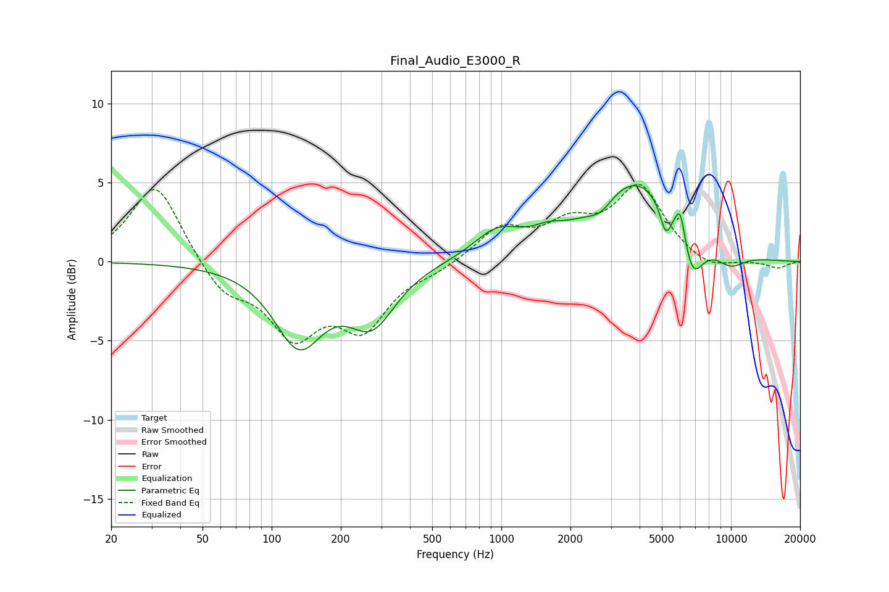

# Final_Audio_E3000_R
See [usage instructions](https://github.com/jaakkopasanen/AutoEq#usage) for more options and info.

### Parametric EQs
Apply preamp of -4.9 dB when using parametric equalizer.

|   # | Type    |   Fc (Hz) |    Q |   Gain (dB) |
|-----|---------|-----------|------|-------------|
|   1 | Peaking |       131 | 1.33 |        -5   |
|   2 | Peaking |       273 | 1.38 |        -3.6 |
|   3 | Peaking |       962 | 1.37 |         1.7 |
|   4 | Peaking |      1601 | 2.01 |         0.7 |
|   5 | Peaking |      2709 | 2.62 |        -0.9 |
|   6 | Peaking |      3851 | 0.77 |         5.2 |
|   7 | Peaking |      5194 | 5.99 |        -1.7 |
|   8 | Peaking |      6026 | 6    |         2.2 |
|   9 | Peaking |      6746 | 2.72 |        -3.1 |
|  10 | Peaking |      9927 | 1.94 |        -1   |

### Fixed Band EQs
When using fixed band (also called graphic) equalizer, apply preamp of **-5.0 dB** (if available) and set gains manually with these parameters.

|   # | Type    |   Fc (Hz) |    Q |   Gain (dB) |
|-----|---------|-----------|------|-------------|
|   1 | Peaking |        31 | 1.41 |         5.1 |
|   2 | Peaking |        62 | 1.41 |        -2   |
|   3 | Peaking |       125 | 1.41 |        -4.3 |
|   4 | Peaking |       250 | 1.41 |        -3.8 |
|   5 | Peaking |       500 | 1.41 |        -0.5 |
|   6 | Peaking |      1000 | 1.41 |         2   |
|   7 | Peaking |      2000 | 1.41 |         2   |
|   8 | Peaking |      4000 | 1.41 |         4.6 |
|   9 | Peaking |      8000 | 1.41 |        -0.7 |
|  10 | Peaking |     16000 | 1.41 |        -0.4 |

### Graphs

