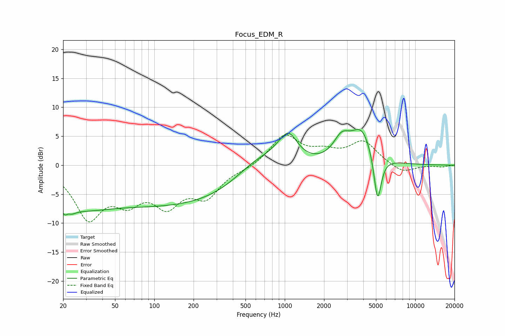

# Focus_EDM_R
See [usage instructions](https://github.com/jaakkopasanen/AutoEq#usage) for more options and info.

### Parametric EQs
Apply preamp of -6.3 dB when using parametric equalizer.

|   # | Type    |   Fc (Hz) |    Q |   Gain (dB) |
|-----|---------|-----------|------|-------------|
|   1 | Peaking |        21 | 3.84 |        -5.9 |
|   2 | Peaking |        22 | 5.36 |         3.6 |
|   3 | Peaking |        26 | 0.67 |        -3.9 |
|   4 | Peaking |       163 | 0.18 |        -7   |
|   5 | Peaking |       613 | 0.74 |         4.7 |
|   6 | Peaking |       986 | 3.49 |        -0.8 |
|   7 | Peaking |      1042 | 1.88 |         6.1 |
|   8 | Peaking |      2726 | 2.23 |         3.5 |
|   9 | Peaking |      3902 | 1.62 |         6   |
|  10 | Peaking |      5146 | 4.73 |        -8.7 |

### Fixed Band EQs
When using fixed band (also called graphic) equalizer, apply preamp of **-5.3 dB** (if available) and set gains manually with these parameters.

|   # | Type    |   Fc (Hz) |    Q |   Gain (dB) |
|-----|---------|-----------|------|-------------|
|   1 | Peaking |        31 | 1.41 |        -8.6 |
|   2 | Peaking |        62 | 1.41 |        -4.8 |
|   3 | Peaking |       125 | 1.41 |        -5.9 |
|   4 | Peaking |       250 | 1.41 |        -4.9 |
|   5 | Peaking |       500 | 1.41 |        -0.5 |
|   6 | Peaking |      1000 | 1.41 |         5.1 |
|   7 | Peaking |      2000 | 1.41 |         1.8 |
|   8 | Peaking |      4000 | 1.41 |         3.9 |
|   9 | Peaking |      8000 | 1.41 |        -1.5 |
|  10 | Peaking |     16000 | 1.41 |        -0.3 |

### Graphs

