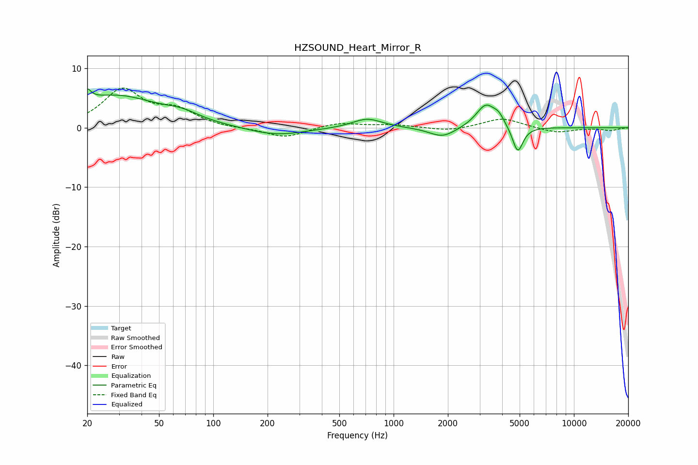

# HZSOUND_Heart_Mirror_R
See [usage instructions](https://github.com/jaakkopasanen/AutoEq#usage) for more options and info.

### Parametric EQs
Apply preamp of -6.6 dB when using parametric equalizer.

|   # | Type    |   Fc (Hz) |    Q |   Gain (dB) |
|-----|---------|-----------|------|-------------|
|   1 | Peaking |        20 | 6    |         5.3 |
|   2 | Peaking |        20 | 6    |        -3.3 |
|   3 | Peaking |        29 | 0.58 |         5.3 |
|   4 | Peaking |        67 | 1.51 |         1.1 |
|   5 | Peaking |       223 | 0.9  |        -1.4 |
|   6 | Peaking |       713 | 1.71 |         1.6 |
|   7 | Peaking |      1868 | 1.93 |        -1.7 |
|   8 | Peaking |      3249 | 2.57 |         3.9 |
|   9 | Peaking |      3837 | 4.67 |         1.3 |
|  10 | Peaking |      4880 | 4.77 |        -4.5 |

### Fixed Band EQs
When using fixed band (also called graphic) equalizer, apply preamp of **-6.8 dB** (if available) and set gains manually with these parameters.

|   # | Type    |   Fc (Hz) |    Q |   Gain (dB) |
|-----|---------|-----------|------|-------------|
|   1 | Peaking |        31 | 1.41 |         6.2 |
|   2 | Peaking |        62 | 1.41 |         2.6 |
|   3 | Peaking |       125 | 1.41 |        -0.2 |
|   4 | Peaking |       250 | 1.41 |        -1.7 |
|   5 | Peaking |       500 | 1.41 |         0.9 |
|   6 | Peaking |      1000 | 1.41 |         0.5 |
|   7 | Peaking |      2000 | 1.41 |        -0.6 |
|   8 | Peaking |      4000 | 1.41 |         1.6 |
|   9 | Peaking |      8000 | 1.41 |        -0.9 |
|  10 | Peaking |     16000 | 1.41 |        -0.5 |

### Graphs

