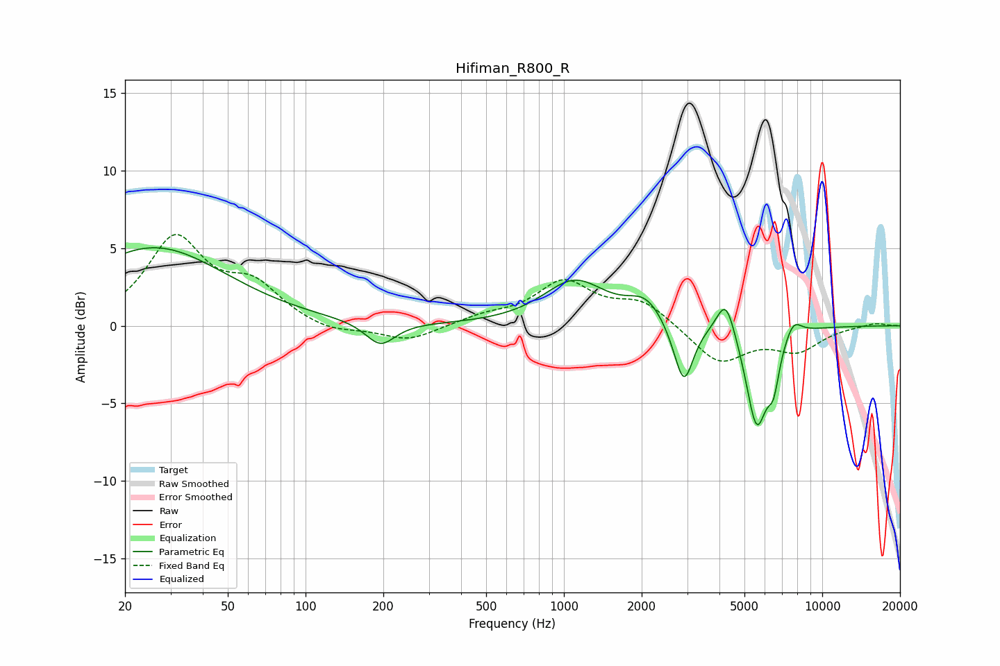

# Hifiman_R800_R
See [usage instructions](https://github.com/jaakkopasanen/AutoEq#usage) for more options and info.

### Parametric EQs
Apply preamp of -5.1 dB when using parametric equalizer.

|   # | Type    |   Fc (Hz) |    Q |   Gain (dB) |
|-----|---------|-----------|------|-------------|
|   1 | Peaking |        26 | 0.51 |         5   |
|   2 | Peaking |       195 | 2.47 |        -1.5 |
|   3 | Peaking |      1100 | 1.17 |         2.8 |
|   4 | Peaking |      2077 | 2.01 |         1.5 |
|   5 | Peaking |      2797 | 2.94 |        -0.8 |
|   6 | Peaking |      2922 | 4    |        -3.3 |
|   7 | Peaking |      4238 | 3.9  |         2.5 |
|   8 | Peaking |      5575 | 3.3  |        -6.4 |
|   9 | Peaking |      6481 | 5.97 |        -2.3 |
|  10 | Peaking |      7731 | 4.17 |         1.1 |

### Fixed Band EQs
When using fixed band (also called graphic) equalizer, apply preamp of **-6.0 dB** (if available) and set gains manually with these parameters.

|   # | Type    |   Fc (Hz) |    Q |   Gain (dB) |
|-----|---------|-----------|------|-------------|
|   1 | Peaking |        31 | 1.41 |         5.5 |
|   2 | Peaking |        62 | 1.41 |         2.3 |
|   3 | Peaking |       125 | 1.41 |        -0.5 |
|   4 | Peaking |       250 | 1.41 |        -1   |
|   5 | Peaking |       500 | 1.41 |         0.5 |
|   6 | Peaking |      1000 | 1.41 |         2.7 |
|   7 | Peaking |      2000 | 1.41 |         1.5 |
|   8 | Peaking |      4000 | 1.41 |        -2.4 |
|   9 | Peaking |      8000 | 1.41 |        -1.5 |
|  10 | Peaking |     16000 | 1.41 |         0.2 |

### Graphs

