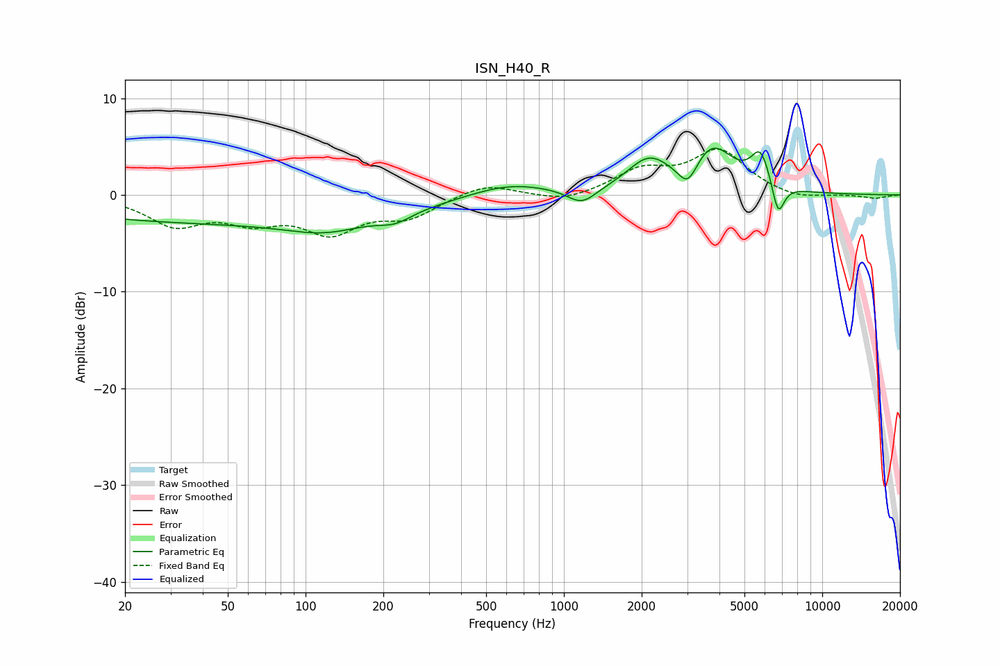

# ISN_H40_R
See [usage instructions](https://github.com/jaakkopasanen/AutoEq#usage) for more options and info.

### Parametric EQs
Apply preamp of -4.9 dB when using parametric equalizer.

|   # | Type    |   Fc (Hz) |    Q |   Gain (dB) |
|-----|---------|-----------|------|-------------|
|   1 | Peaking |        50 | 0.18 |        -2.8 |
|   2 | Peaking |       119 | 0.96 |        -1.4 |
|   3 | Peaking |       222 | 2.25 |        -0.9 |
|   4 | Peaking |       609 | 0.88 |         1.4 |
|   5 | Peaking |      1174 | 2.53 |        -1.7 |
|   6 | Peaking |      2126 | 1.71 |         3.2 |
|   7 | Peaking |      3019 | 3.72 |        -2.6 |
|   8 | Peaking |      3749 | 1.68 |         4.6 |
|   9 | Peaking |      5773 | 3.75 |         3.6 |
|  10 | Peaking |      6753 | 5.75 |        -3.5 |

### Fixed Band EQs
When using fixed band (also called graphic) equalizer, apply preamp of **-4.8 dB** (if available) and set gains manually with these parameters.

|   # | Type    |   Fc (Hz) |    Q |   Gain (dB) |
|-----|---------|-----------|------|-------------|
|   1 | Peaking |        31 | 1.41 |        -2.9 |
|   2 | Peaking |        62 | 1.41 |        -2.2 |
|   3 | Peaking |       125 | 1.41 |        -3.5 |
|   4 | Peaking |       250 | 1.41 |        -2.1 |
|   5 | Peaking |       500 | 1.41 |         1.3 |
|   6 | Peaking |      1000 | 1.41 |        -0.8 |
|   7 | Peaking |      2000 | 1.41 |         2.3 |
|   8 | Peaking |      4000 | 1.41 |         4.4 |
|   9 | Peaking |      8000 | 1.41 |        -0.6 |
|  10 | Peaking |     16000 | 1.41 |        -0.4 |

### Graphs

