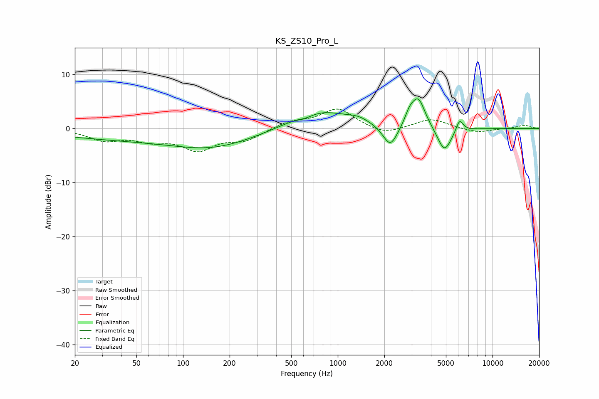

# KS_ZS10_Pro_L
See [usage instructions](https://github.com/jaakkopasanen/AutoEq#usage) for more options and info.

### Parametric EQs
Apply preamp of -5.6 dB when using parametric equalizer.

|   # | Type    |   Fc (Hz) |    Q |   Gain (dB) |
|-----|---------|-----------|------|-------------|
|   1 | Peaking |        78 | 0.18 |        -2.2 |
|   2 | Peaking |       152 | 0.62 |        -1.7 |
|   3 | Peaking |       623 | 2.44 |        -0.7 |
|   4 | Peaking |       727 | 0.74 |         3.8 |
|   5 | Peaking |      1356 | 2    |         0.9 |
|   6 | Peaking |      2186 | 2.97 |        -4.2 |
|   7 | Peaking |      2908 | 4.82 |         1.8 |
|   8 | Peaking |      3312 | 3.1  |         5.6 |
|   9 | Peaking |      4888 | 3.05 |        -4.6 |
|  10 | Peaking |      6126 | 6    |         2.3 |

### Fixed Band EQs
When using fixed band (also called graphic) equalizer, apply preamp of **-3.7 dB** (if available) and set gains manually with these parameters.

|   # | Type    |   Fc (Hz) |    Q |   Gain (dB) |
|-----|---------|-----------|------|-------------|
|   1 | Peaking |        31 | 1.41 |        -2   |
|   2 | Peaking |        62 | 1.41 |        -1.8 |
|   3 | Peaking |       125 | 1.41 |        -3.6 |
|   4 | Peaking |       250 | 1.41 |        -2   |
|   5 | Peaking |       500 | 1.41 |         1.3 |
|   6 | Peaking |      1000 | 1.41 |         3.6 |
|   7 | Peaking |      2000 | 1.41 |        -1.3 |
|   8 | Peaking |      4000 | 1.41 |         1.8 |
|   9 | Peaking |      8000 | 1.41 |        -0.8 |
|  10 | Peaking |     16000 | 1.41 |         0.6 |

### Graphs

