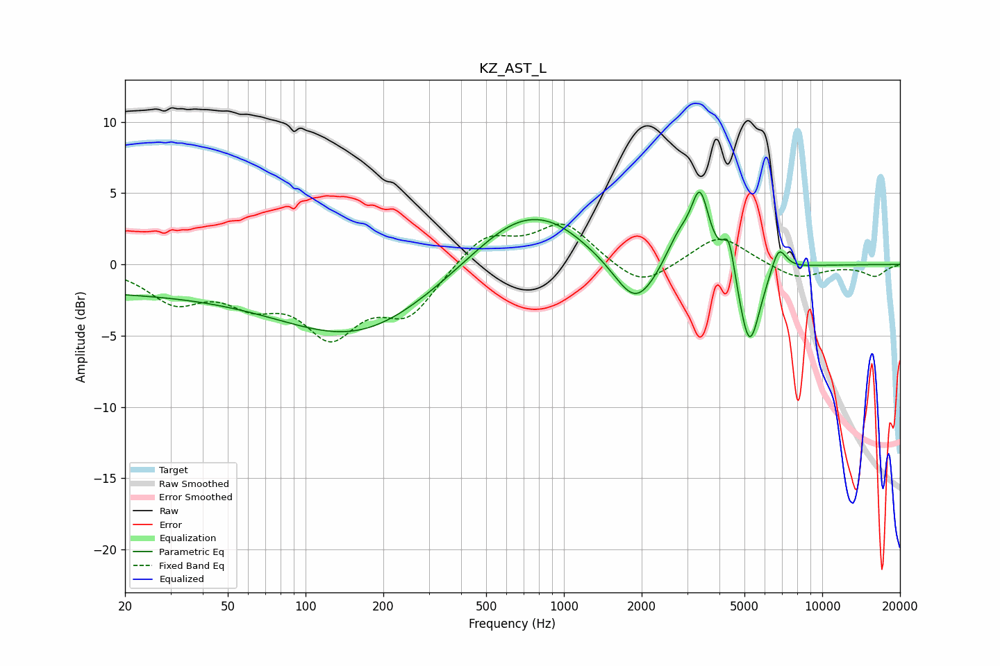

# KZ_AST_L
See [usage instructions](https://github.com/jaakkopasanen/AutoEq#usage) for more options and info.

### Parametric EQs
Apply preamp of -5.2 dB when using parametric equalizer.

|   # | Type    |   Fc (Hz) |    Q |   Gain (dB) |
|-----|---------|-----------|------|-------------|
|   1 | Peaking |        20 | 0.18 |        -1.9 |
|   2 | Peaking |       164 | 0.49 |        -4.4 |
|   3 | Peaking |       697 | 0.71 |         4   |
|   4 | Peaking |       955 | 1.38 |         0.4 |
|   5 | Peaking |      1895 | 1.68 |        -3.5 |
|   6 | Peaking |      2776 | 2.76 |         1.9 |
|   7 | Peaking |      3365 | 3.95 |         4.9 |
|   8 | Peaking |      4350 | 6    |         2.7 |
|   9 | Peaking |      5227 | 3.3  |        -6.1 |
|  10 | Peaking |      6777 | 4.61 |         1.9 |

### Fixed Band EQs
When using fixed band (also called graphic) equalizer, apply preamp of **-2.9 dB** (if available) and set gains manually with these parameters.

|   # | Type    |   Fc (Hz) |    Q |   Gain (dB) |
|-----|---------|-----------|------|-------------|
|   1 | Peaking |        31 | 1.41 |        -2.4 |
|   2 | Peaking |        62 | 1.41 |        -2.1 |
|   3 | Peaking |       125 | 1.41 |        -4.5 |
|   4 | Peaking |       250 | 1.41 |        -3.2 |
|   5 | Peaking |       500 | 1.41 |         2.2 |
|   6 | Peaking |      1000 | 1.41 |         2.8 |
|   7 | Peaking |      2000 | 1.41 |        -1.8 |
|   8 | Peaking |      4000 | 1.41 |         2.1 |
|   9 | Peaking |      8000 | 1.41 |        -1   |
|  10 | Peaking |     16000 | 1.41 |        -0.8 |

### Graphs

