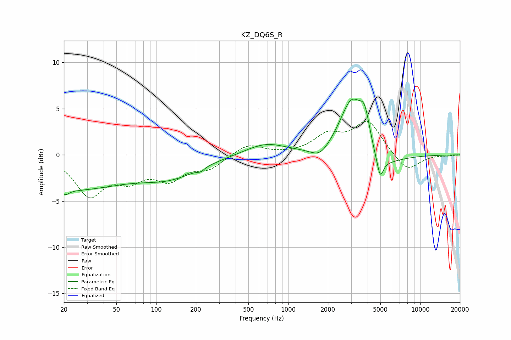

# KZ_DQ6S_R
See [usage instructions](https://github.com/jaakkopasanen/AutoEq#usage) for more options and info.

### Parametric EQs
Apply preamp of -6.1 dB when using parametric equalizer.

|   # | Type    |   Fc (Hz) |    Q |   Gain (dB) |
|-----|---------|-----------|------|-------------|
|   1 | Peaking |        21 | 5.02 |        -0.5 |
|   2 | Peaking |        21 | 0.33 |        -3.6 |
|   3 | Peaking |       129 | 0.62 |        -2   |
|   4 | Peaking |       217 | 5.65 |        -0.3 |
|   5 | Peaking |       674 | 0.91 |         1.3 |
|   6 | Peaking |      1746 | 2.01 |        -1.2 |
|   7 | Peaking |      3046 | 1.5  |         6.9 |
|   8 | Peaking |      3816 | 3.37 |         3.6 |
|   9 | Peaking |      4401 | 1.03 |        -2.9 |
|  10 | Peaking |      4982 | 6    |        -2.1 |

### Fixed Band EQs
When using fixed band (also called graphic) equalizer, apply preamp of **-3.7 dB** (if available) and set gains manually with these parameters.

|   # | Type    |   Fc (Hz) |    Q |   Gain (dB) |
|-----|---------|-----------|------|-------------|
|   1 | Peaking |        31 | 1.41 |        -4.2 |
|   2 | Peaking |        62 | 1.41 |        -2.2 |
|   3 | Peaking |       125 | 1.41 |        -2.3 |
|   4 | Peaking |       250 | 1.41 |        -1.3 |
|   5 | Peaking |       500 | 1.41 |         1.2 |
|   6 | Peaking |      1000 | 1.41 |         0   |
|   7 | Peaking |      2000 | 1.41 |         2   |
|   8 | Peaking |      4000 | 1.41 |         3.5 |
|   9 | Peaking |      8000 | 1.41 |        -1.9 |
|  10 | Peaking |     16000 | 1.41 |        -0.1 |

### Graphs

