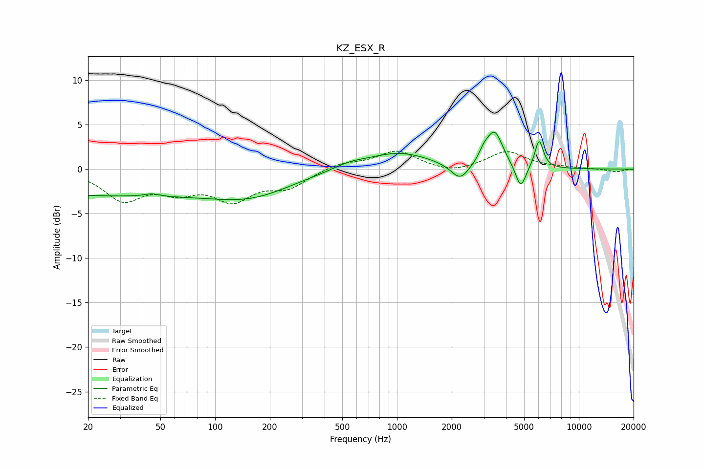

# KZ_ESX_R
See [usage instructions](https://github.com/jaakkopasanen/AutoEq#usage) for more options and info.

### Parametric EQs
Apply preamp of -4.2 dB when using parametric equalizer.

|   # | Type    |   Fc (Hz) |    Q |   Gain (dB) |
|-----|---------|-----------|------|-------------|
|   1 | Peaking |        24 | 0.18 |        -2.9 |
|   2 | Peaking |        45 | 3.36 |         0.3 |
|   3 | Peaking |       163 | 0.64 |        -2.1 |
|   4 | Peaking |       544 | 1.56 |         0.6 |
|   5 | Peaking |      1021 | 0.81 |         1.9 |
|   6 | Peaking |      2224 | 2.84 |        -1.9 |
|   7 | Peaking |      3001 | 5.52 |         0.9 |
|   8 | Peaking |      3436 | 3.09 |         4   |
|   9 | Peaking |      4789 | 4.89 |        -2.7 |
|  10 | Peaking |      6046 | 6    |         3.2 |

### Fixed Band EQs
When using fixed band (also called graphic) equalizer, apply preamp of **-2.1 dB** (if available) and set gains manually with these parameters.

|   # | Type    |   Fc (Hz) |    Q |   Gain (dB) |
|-----|---------|-----------|------|-------------|
|   1 | Peaking |        31 | 1.41 |        -3.3 |
|   2 | Peaking |        62 | 1.41 |        -2   |
|   3 | Peaking |       125 | 1.41 |        -3.1 |
|   4 | Peaking |       250 | 1.41 |        -1.9 |
|   5 | Peaking |       500 | 1.41 |         0.7 |
|   6 | Peaking |      1000 | 1.41 |         2   |
|   7 | Peaking |      2000 | 1.41 |        -0.6 |
|   8 | Peaking |      4000 | 1.41 |         2   |
|   9 | Peaking |      8000 | 1.41 |         0.1 |
|  10 | Peaking |     16000 | 1.41 |        -0.3 |

### Graphs

