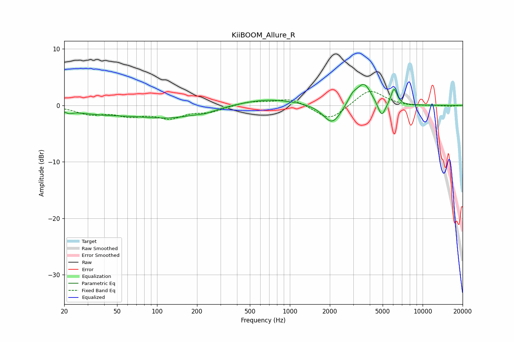

# KiiBOOM_Allure_R
See [usage instructions](https://github.com/jaakkopasanen/AutoEq#usage) for more options and info.

### Parametric EQs
Apply preamp of -3.8 dB when using parametric equalizer.

|   # | Type    |   Fc (Hz) |    Q |   Gain (dB) |
|-----|---------|-----------|------|-------------|
|   1 | Peaking |        22 | 5.91 |        -0.5 |
|   2 | Peaking |        36 | 0.6  |        -1.2 |
|   3 | Peaking |       127 | 0.56 |        -2   |
|   4 | Peaking |       233 | 2.4  |        -0.3 |
|   5 | Peaking |       679 | 0.63 |         1.2 |
|   6 | Peaking |      2082 | 2.12 |        -3.6 |
|   7 | Peaking |      2965 | 3.88 |         1.4 |
|   8 | Peaking |      3618 | 2.58 |         3.9 |
|   9 | Peaking |      4919 | 4.9  |        -2.7 |
|  10 | Peaking |      6088 | 6    |         2.9 |

### Fixed Band EQs
When using fixed band (also called graphic) equalizer, apply preamp of **-2.6 dB** (if available) and set gains manually with these parameters.

|   # | Type    |   Fc (Hz) |    Q |   Gain (dB) |
|-----|---------|-----------|------|-------------|
|   1 | Peaking |        31 | 1.41 |        -1.4 |
|   2 | Peaking |        62 | 1.41 |        -1.5 |
|   3 | Peaking |       125 | 1.41 |        -2   |
|   4 | Peaking |       250 | 1.41 |        -1   |
|   5 | Peaking |       500 | 1.41 |         0.7 |
|   6 | Peaking |      1000 | 1.41 |         1.3 |
|   7 | Peaking |      2000 | 1.41 |        -2.8 |
|   8 | Peaking |      4000 | 1.41 |         2.9 |
|   9 | Peaking |      8000 | 1.41 |        -0.2 |
|  10 | Peaking |     16000 | 1.41 |        -0.2 |

### Graphs

