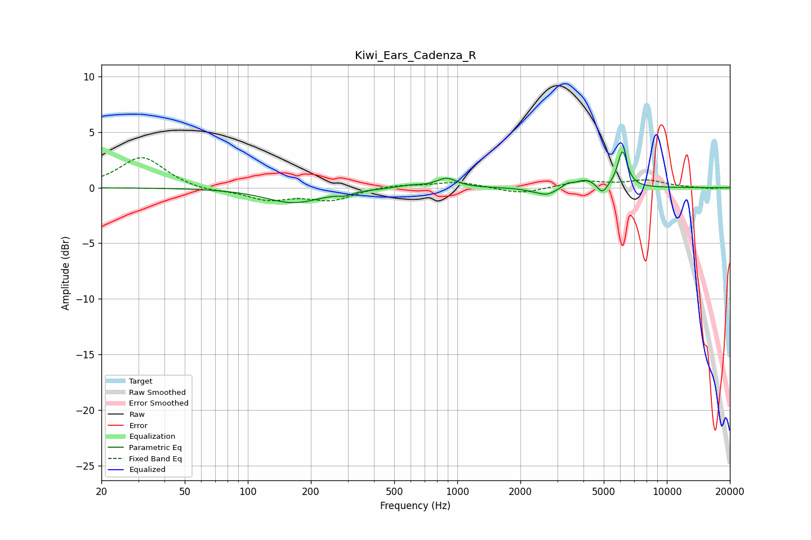

# Kiwi_Ears_Cadenza_R
See [usage instructions](https://github.com/jaakkopasanen/AutoEq#usage) for more options and info.

### Parametric EQs
Apply preamp of -3.3 dB when using parametric equalizer.

|   # | Type    |   Fc (Hz) |    Q |   Gain (dB) |
|-----|---------|-----------|------|-------------|
|   1 | Peaking |       165 | 1.05 |        -1.3 |
|   2 | Peaking |       292 | 4.46 |        -0.3 |
|   3 | Peaking |       592 | 2.44 |         0.2 |
|   4 | Peaking |       888 | 2.93 |         0.8 |
|   5 | Peaking |      2290 | 2.67 |        -0.2 |
|   6 | Peaking |      2678 | 3.19 |        -0.6 |
|   7 | Peaking |      3371 | 6    |         0.3 |
|   8 | Peaking |      4106 | 2.97 |         0.7 |
|   9 | Peaking |      4921 | 6    |        -0.9 |
|  10 | Peaking |      6145 | 5.96 |         3.3 |

### Fixed Band EQs
When using fixed band (also called graphic) equalizer, apply preamp of **-2.8 dB** (if available) and set gains manually with these parameters.

|   # | Type    |   Fc (Hz) |    Q |   Gain (dB) |
|-----|---------|-----------|------|-------------|
|   1 | Peaking |        31 | 1.41 |         2.8 |
|   2 | Peaking |        62 | 1.41 |        -0.3 |
|   3 | Peaking |       125 | 1.41 |        -1   |
|   4 | Peaking |       250 | 1.41 |        -1.1 |
|   5 | Peaking |       500 | 1.41 |         0.3 |
|   6 | Peaking |      1000 | 1.41 |         0.5 |
|   7 | Peaking |      2000 | 1.41 |        -0.6 |
|   8 | Peaking |      4000 | 1.41 |         0.6 |
|   9 | Peaking |      8000 | 1.41 |         0.6 |
|  10 | Peaking |     16000 | 1.41 |        -0.1 |

### Graphs

