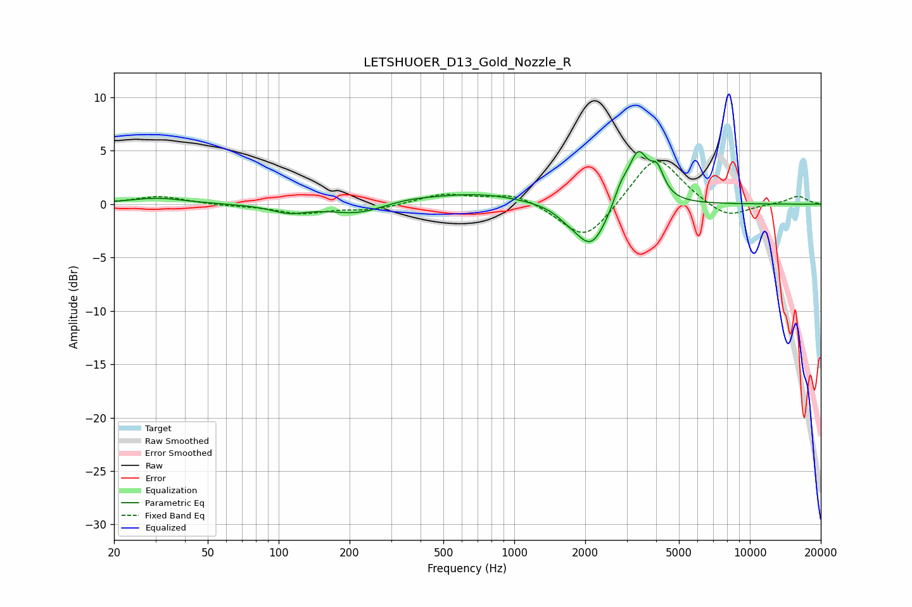

# LETSHUOER_D13_Gold_Nozzle_R
See [usage instructions](https://github.com/jaakkopasanen/AutoEq#usage) for more options and info.

### Parametric EQs
Apply preamp of -5.0 dB when using parametric equalizer.

|   # | Type    |   Fc (Hz) |    Q |   Gain (dB) |
|-----|---------|-----------|------|-------------|
|   1 | Peaking |        31 | 1.2  |         0.6 |
|   2 | Peaking |       111 | 1.85 |        -0.7 |
|   3 | Peaking |       218 | 1.21 |        -1   |
|   4 | Peaking |       349 | 1.12 |         0.4 |
|   5 | Peaking |       708 | 0.72 |         1   |
|   6 | Peaking |      1688 | 2.87 |        -0.5 |
|   7 | Peaking |      2121 | 2.08 |        -4.2 |
|   8 | Peaking |      2826 | 4.66 |         1.4 |
|   9 | Peaking |      3355 | 3.22 |         4.8 |
|  10 | Peaking |      4046 | 4.87 |         2.3 |

### Fixed Band EQs
When using fixed band (also called graphic) equalizer, apply preamp of **-4.1 dB** (if available) and set gains manually with these parameters.

|   # | Type    |   Fc (Hz) |    Q |   Gain (dB) |
|-----|---------|-----------|------|-------------|
|   1 | Peaking |        31 | 1.41 |         0.8 |
|   2 | Peaking |        62 | 1.41 |        -0.1 |
|   3 | Peaking |       125 | 1.41 |        -0.8 |
|   4 | Peaking |       250 | 1.41 |        -0.5 |
|   5 | Peaking |       500 | 1.41 |         0.9 |
|   6 | Peaking |      1000 | 1.41 |         1   |
|   7 | Peaking |      2000 | 1.41 |        -3.6 |
|   8 | Peaking |      4000 | 1.41 |         4.8 |
|   9 | Peaking |      8000 | 1.41 |        -1.5 |
|  10 | Peaking |     16000 | 1.41 |         0.8 |

### Graphs

