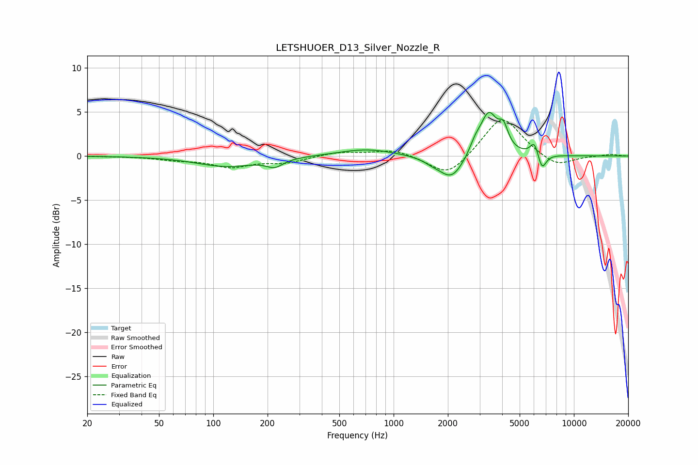

# LETSHUOER_D13_Silver_Nozzle_R
See [usage instructions](https://github.com/jaakkopasanen/AutoEq#usage) for more options and info.

### Parametric EQs
Apply preamp of -5.0 dB when using parametric equalizer.

|   # | Type    |   Fc (Hz) |    Q |   Gain (dB) |
|-----|---------|-----------|------|-------------|
|   1 | Peaking |       119 | 0.85 |        -1.2 |
|   2 | Peaking |       219 | 3.13 |        -0.9 |
|   3 | Peaking |       707 | 0.93 |         0.8 |
|   4 | Peaking |      1643 | 2.73 |        -0.4 |
|   5 | Peaking |      2099 | 2.09 |        -2.7 |
|   6 | Peaking |      2832 | 4.62 |         1   |
|   7 | Peaking |      3365 | 2.98 |         4.7 |
|   8 | Peaking |      4061 | 5.31 |         2.2 |
|   9 | Peaking |      6043 | 6    |         1.6 |
|  10 | Peaking |      6647 | 5.9  |        -1.9 |

### Fixed Band EQs
When using fixed band (also called graphic) equalizer, apply preamp of **-4.2 dB** (if available) and set gains manually with these parameters.

|   # | Type    |   Fc (Hz) |    Q |   Gain (dB) |
|-----|---------|-----------|------|-------------|
|   1 | Peaking |        31 | 1.41 |        -0   |
|   2 | Peaking |        62 | 1.41 |        -0.4 |
|   3 | Peaking |       125 | 1.41 |        -1.2 |
|   4 | Peaking |       250 | 1.41 |        -0.7 |
|   5 | Peaking |       500 | 1.41 |         0.5 |
|   6 | Peaking |      1000 | 1.41 |         0.8 |
|   7 | Peaking |      2000 | 1.41 |        -2.5 |
|   8 | Peaking |      4000 | 1.41 |         4.7 |
|   9 | Peaking |      8000 | 1.41 |        -1.3 |
|  10 | Peaking |     16000 | 1.41 |         0.2 |

### Graphs

