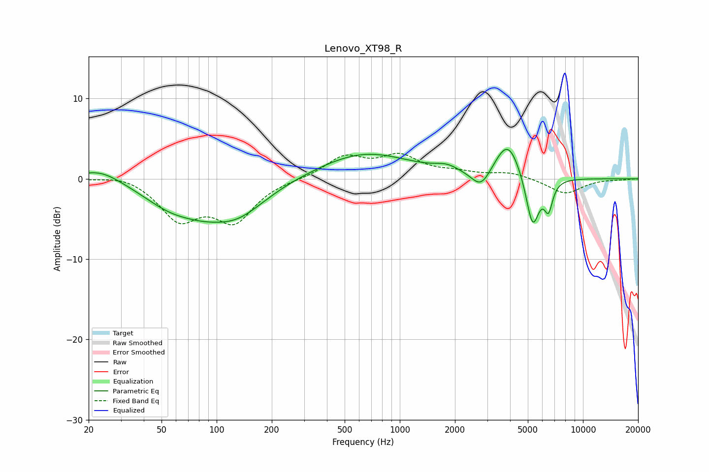

# Lenovo_XT98_R
See [usage instructions](https://github.com/jaakkopasanen/AutoEq#usage) for more options and info.

### Parametric EQs
Apply preamp of -3.8 dB when using parametric equalizer.

|   # | Type    |   Fc (Hz) |    Q |   Gain (dB) |
|-----|---------|-----------|------|-------------|
|   1 | Peaking |        23 | 1.22 |         1.6 |
|   2 | Peaking |        58 | 0.89 |        -2.9 |
|   3 | Peaking |        84 | 1.55 |        -0.6 |
|   4 | Peaking |       126 | 0.84 |        -4.4 |
|   5 | Peaking |       642 | 0.56 |         3.3 |
|   6 | Peaking |      1805 | 2.17 |         0.8 |
|   7 | Peaking |      2779 | 2.66 |        -2.4 |
|   8 | Peaking |      3891 | 1.98 |         4.9 |
|   9 | Peaking |      5309 | 3.72 |        -6.7 |
|  10 | Peaking |      6485 | 6    |        -3.3 |

### Fixed Band EQs
When using fixed band (also called graphic) equalizer, apply preamp of **-3.3 dB** (if available) and set gains manually with these parameters.

|   # | Type    |   Fc (Hz) |    Q |   Gain (dB) |
|-----|---------|-----------|------|-------------|
|   1 | Peaking |        31 | 1.41 |         0.7 |
|   2 | Peaking |        62 | 1.41 |        -4.8 |
|   3 | Peaking |       125 | 1.41 |        -4.9 |
|   4 | Peaking |       250 | 1.41 |        -0   |
|   5 | Peaking |       500 | 1.41 |         2.6 |
|   6 | Peaking |      1000 | 1.41 |         2.6 |
|   7 | Peaking |      2000 | 1.41 |         0.6 |
|   8 | Peaking |      4000 | 1.41 |         0.8 |
|   9 | Peaking |      8000 | 1.41 |        -1.9 |
|  10 | Peaking |     16000 | 1.41 |        -0.1 |

### Graphs

