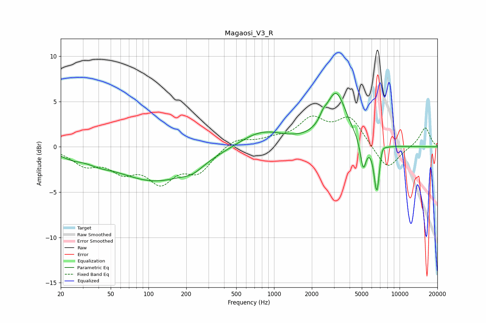

# Magaosi_V3_R
See [usage instructions](https://github.com/jaakkopasanen/AutoEq#usage) for more options and info.

### Parametric EQs
Apply preamp of -6.0 dB when using parametric equalizer.

|   # | Type    |   Fc (Hz) |    Q |   Gain (dB) |
|-----|---------|-----------|------|-------------|
|   1 | Peaking |        24 | 1.65 |        -0.6 |
|   2 | Peaking |        40 | 1.46 |        -0.6 |
|   3 | Peaking |       113 | 0.45 |        -3.7 |
|   4 | Peaking |       225 | 1.77 |        -0.7 |
|   5 | Peaking |       799 | 0.79 |         1.8 |
|   6 | Peaking |      2456 | 5.54 |         0.6 |
|   7 | Peaking |      3116 | 1.7  |         5.8 |
|   8 | Peaking |      5132 | 6    |        -3.2 |
|   9 | Peaking |      6588 | 6    |        -5.5 |
|  10 | Peaking |      7227 | 6    |         1   |

### Fixed Band EQs
When using fixed band (also called graphic) equalizer, apply preamp of **-3.5 dB** (if available) and set gains manually with these parameters.

|   # | Type    |   Fc (Hz) |    Q |   Gain (dB) |
|-----|---------|-----------|------|-------------|
|   1 | Peaking |        31 | 1.41 |        -1.8 |
|   2 | Peaking |        62 | 1.41 |        -2.2 |
|   3 | Peaking |       125 | 1.41 |        -3.4 |
|   4 | Peaking |       250 | 1.41 |        -2.5 |
|   5 | Peaking |       500 | 1.41 |         1   |
|   6 | Peaking |      1000 | 1.41 |         0.6 |
|   7 | Peaking |      2000 | 1.41 |         2.8 |
|   8 | Peaking |      4000 | 1.41 |         3.1 |
|   9 | Peaking |      8000 | 1.41 |        -2.7 |
|  10 | Peaking |     16000 | 1.41 |         2.2 |

### Graphs

