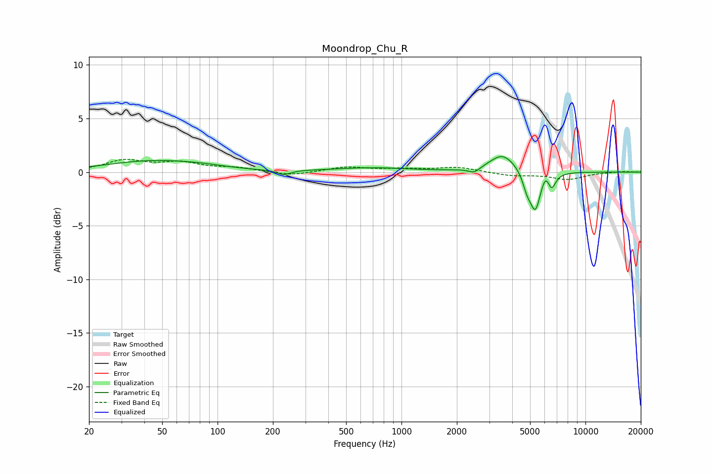

# Moondrop_Chu_R
See [usage instructions](https://github.com/jaakkopasanen/AutoEq#usage) for more options and info.

### Parametric EQs
Apply preamp of -1.5 dB when using parametric equalizer.

|   # | Type    |   Fc (Hz) |    Q |   Gain (dB) |
|-----|---------|-----------|------|-------------|
|   1 | Peaking |        43 | 0.59 |         1   |
|   2 | Peaking |        82 | 1.02 |         0.3 |
|   3 | Peaking |       230 | 3.86 |        -0.4 |
|   4 | Peaking |       690 | 0.68 |         0.4 |
|   5 | Peaking |      2482 | 4.59 |        -0.5 |
|   6 | Peaking |      3556 | 1.97 |         1.7 |
|   7 | Peaking |      4811 | 6    |        -1.3 |
|   8 | Peaking |      5341 | 4.81 |        -3.5 |
|   9 | Peaking |      6096 | 6    |         1   |
|  10 | Peaking |      6531 | 6    |        -1.5 |

### Fixed Band EQs
When using fixed band (also called graphic) equalizer, apply preamp of **-1.3 dB** (if available) and set gains manually with these parameters.

|   # | Type    |   Fc (Hz) |    Q |   Gain (dB) |
|-----|---------|-----------|------|-------------|
|   1 | Peaking |        31 | 1.41 |         1   |
|   2 | Peaking |        62 | 1.41 |         0.8 |
|   3 | Peaking |       125 | 1.41 |         0.4 |
|   4 | Peaking |       250 | 1.41 |        -0.4 |
|   5 | Peaking |       500 | 1.41 |         0.5 |
|   6 | Peaking |      1000 | 1.41 |         0.2 |
|   7 | Peaking |      2000 | 1.41 |         0.4 |
|   8 | Peaking |      4000 | 1.41 |        -0.3 |
|   9 | Peaking |      8000 | 1.41 |        -0.7 |
|  10 | Peaking |     16000 | 1.41 |         0.1 |

### Graphs

