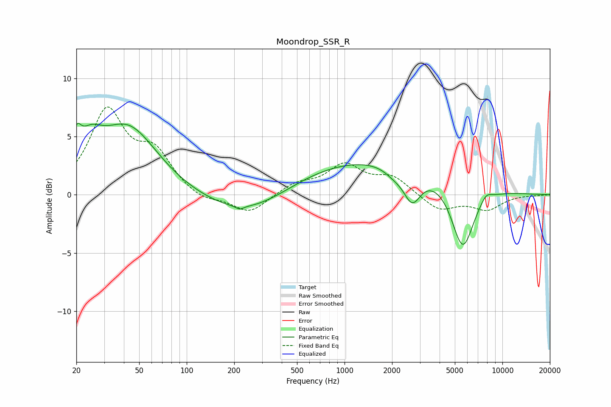

# Moondrop_SSR_R
See [usage instructions](https://github.com/jaakkopasanen/AutoEq#usage) for more options and info.

### Parametric EQs
Apply preamp of -6.2 dB when using parametric equalizer.

|   # | Type    |   Fc (Hz) |    Q |   Gain (dB) |
|-----|---------|-----------|------|-------------|
|   1 | Peaking |        20 | 5.07 |         2.2 |
|   2 | Peaking |        24 | 1.88 |         2.4 |
|   3 | Peaking |        42 | 0.75 |         5.7 |
|   4 | Peaking |       216 | 5.91 |        -0.3 |
|   5 | Peaking |       259 | 0.51 |        -3.3 |
|   6 | Peaking |      1069 | 0.19 |         3.4 |
|   7 | Peaking |      2055 | 2.27 |        -0.6 |
|   8 | Peaking |      2679 | 2.55 |        -2.7 |
|   9 | Peaking |      5605 | 1.93 |        -5.8 |
|  10 | Peaking |      7890 | 3.86 |         0.6 |

### Fixed Band EQs
When using fixed band (also called graphic) equalizer, apply preamp of **-7.6 dB** (if available) and set gains manually with these parameters.

|   # | Type    |   Fc (Hz) |    Q |   Gain (dB) |
|-----|---------|-----------|------|-------------|
|   1 | Peaking |        31 | 1.41 |         7   |
|   2 | Peaking |        62 | 1.41 |         3.2 |
|   3 | Peaking |       125 | 1.41 |        -0.7 |
|   4 | Peaking |       250 | 1.41 |        -1.6 |
|   5 | Peaking |       500 | 1.41 |         0.9 |
|   6 | Peaking |      1000 | 1.41 |         2.4 |
|   7 | Peaking |      2000 | 1.41 |         1.4 |
|   8 | Peaking |      4000 | 1.41 |        -1.4 |
|   9 | Peaking |      8000 | 1.41 |        -1.2 |
|  10 | Peaking |     16000 | 1.41 |        -0   |

### Graphs

