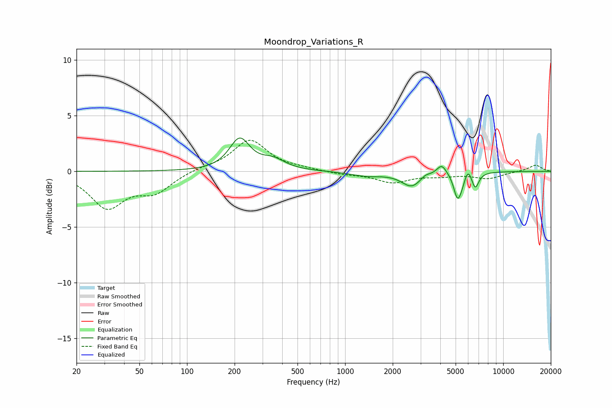

# Moondrop_Variations_R
See [usage instructions](https://github.com/jaakkopasanen/AutoEq#usage) for more options and info.

### Parametric EQs
Apply preamp of -3.1 dB when using parametric equalizer.

|   # | Type    |   Fc (Hz) |    Q |   Gain (dB) |
|-----|---------|-----------|------|-------------|
|   1 | Peaking |       215 | 2.2  |         2.8 |
|   2 | Peaking |       350 | 1.87 |         0.9 |
|   3 | Peaking |      1363 | 1.37 |        -0.4 |
|   4 | Peaking |      2638 | 2.22 |        -1.3 |
|   5 | Peaking |      3210 | 4.77 |         0.3 |
|   6 | Peaking |      4086 | 4.55 |         0.9 |
|   7 | Peaking |      5143 | 5.83 |        -2.2 |
|   8 | Peaking |      5495 | 6    |        -0.6 |
|   9 | Peaking |      5983 | 6    |         0.9 |
|  10 | Peaking |      6651 | 6    |        -1.4 |

### Fixed Band EQs
When using fixed band (also called graphic) equalizer, apply preamp of **-2.9 dB** (if available) and set gains manually with these parameters.

|   # | Type    |   Fc (Hz) |    Q |   Gain (dB) |
|-----|---------|-----------|------|-------------|
|   1 | Peaking |        31 | 1.41 |        -3.1 |
|   2 | Peaking |        62 | 1.41 |        -1.7 |
|   3 | Peaking |       125 | 1.41 |         0.3 |
|   4 | Peaking |       250 | 1.41 |         2.8 |
|   5 | Peaking |       500 | 1.41 |         0.2 |
|   6 | Peaking |      1000 | 1.41 |        -0.2 |
|   7 | Peaking |      2000 | 1.41 |        -1   |
|   8 | Peaking |      4000 | 1.41 |        -0.3 |
|   9 | Peaking |      8000 | 1.41 |        -0.6 |
|  10 | Peaking |     16000 | 1.41 |         0.6 |

### Graphs

