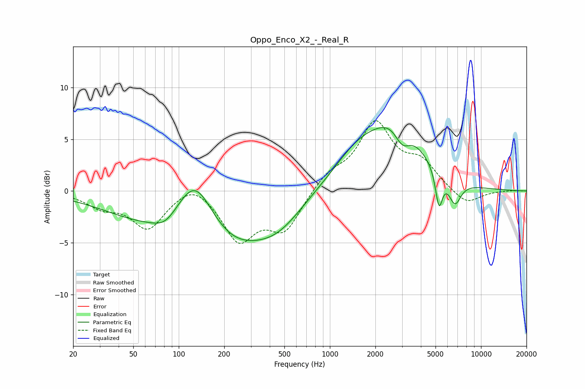

# Oppo_Enco_X2_-_Real_R
See [usage instructions](https://github.com/jaakkopasanen/AutoEq#usage) for more options and info.

### Parametric EQs
Apply preamp of -6.2 dB when using parametric equalizer.

|   # | Type    |   Fc (Hz) |    Q |   Gain (dB) |
|-----|---------|-----------|------|-------------|
|   1 | Peaking |        70 | 0.45 |        -2.9 |
|   2 | Peaking |        82 | 1.82 |        -1.1 |
|   3 | Peaking |       128 | 1.08 |         6.1 |
|   4 | Peaking |       220 | 0.55 |        -4.9 |
|   5 | Peaking |       460 | 0.89 |        -2   |
|   6 | Peaking |      1578 | 0.79 |         3.5 |
|   7 | Peaking |      2930 | 0.94 |         6.1 |
|   8 | Peaking |      3014 | 2.39 |        -2.9 |
|   9 | Peaking |      5271 | 6    |        -3.4 |
|  10 | Peaking |      6715 | 3.34 |        -2.4 |

### Fixed Band EQs
When using fixed band (also called graphic) equalizer, apply preamp of **-6.9 dB** (if available) and set gains manually with these parameters.

|   # | Type    |   Fc (Hz) |    Q |   Gain (dB) |
|-----|---------|-----------|------|-------------|
|   1 | Peaking |        31 | 1.41 |        -1.3 |
|   2 | Peaking |        62 | 1.41 |        -3.5 |
|   3 | Peaking |       125 | 1.41 |         1.3 |
|   4 | Peaking |       250 | 1.41 |        -4.6 |
|   5 | Peaking |       500 | 1.41 |        -3.6 |
|   6 | Peaking |      1000 | 1.41 |         1.5 |
|   7 | Peaking |      2000 | 1.41 |         6.3 |
|   8 | Peaking |      4000 | 1.41 |         2.4 |
|   9 | Peaking |      8000 | 1.41 |        -1.4 |
|  10 | Peaking |     16000 | 1.41 |         0.1 |

### Graphs

