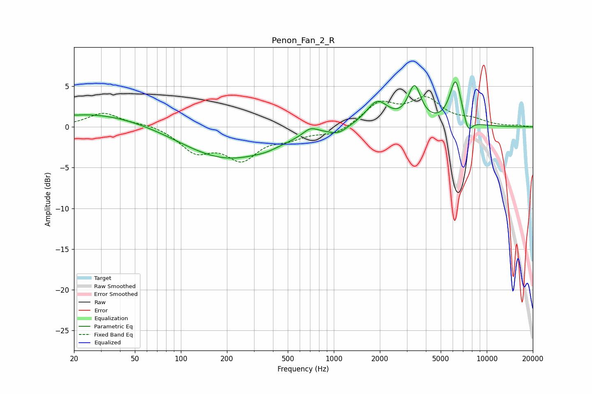

# Penon_Fan_2_R
See [usage instructions](https://github.com/jaakkopasanen/AutoEq#usage) for more options and info.

### Parametric EQs
Apply preamp of -5.6 dB when using parametric equalizer.

|   # | Type    |   Fc (Hz) |    Q |   Gain (dB) |
|-----|---------|-----------|------|-------------|
|   1 | Peaking |        21 | 5.54 |        -0   |
|   2 | Peaking |        27 | 0.39 |         1.8 |
|   3 | Peaking |       201 | 0.47 |        -4   |
|   4 | Peaking |       364 | 1.87 |        -0.3 |
|   5 | Peaking |       703 | 2.94 |         0.9 |
|   6 | Peaking |      1071 | 2.67 |        -0.7 |
|   7 | Peaking |      1920 | 1.95 |         3   |
|   8 | Peaking |      3371 | 3.35 |         4.5 |
|   9 | Peaking |      6254 | 3.46 |         5.6 |
|  10 | Peaking |      7539 | 4.88 |        -1.9 |

### Fixed Band EQs
When using fixed band (also called graphic) equalizer, apply preamp of **-3.8 dB** (if available) and set gains manually with these parameters.

|   # | Type    |   Fc (Hz) |    Q |   Gain (dB) |
|-----|---------|-----------|------|-------------|
|   1 | Peaking |        31 | 1.41 |         1.7 |
|   2 | Peaking |        62 | 1.41 |         0.4 |
|   3 | Peaking |       125 | 1.41 |        -2.8 |
|   4 | Peaking |       250 | 1.41 |        -3.6 |
|   5 | Peaking |       500 | 1.41 |        -1.1 |
|   6 | Peaking |      1000 | 1.41 |        -1   |
|   7 | Peaking |      2000 | 1.41 |         2.8 |
|   8 | Peaking |      4000 | 1.41 |         3.2 |
|   9 | Peaking |      8000 | 1.41 |         0.7 |
|  10 | Peaking |     16000 | 1.41 |         0.2 |

### Graphs

