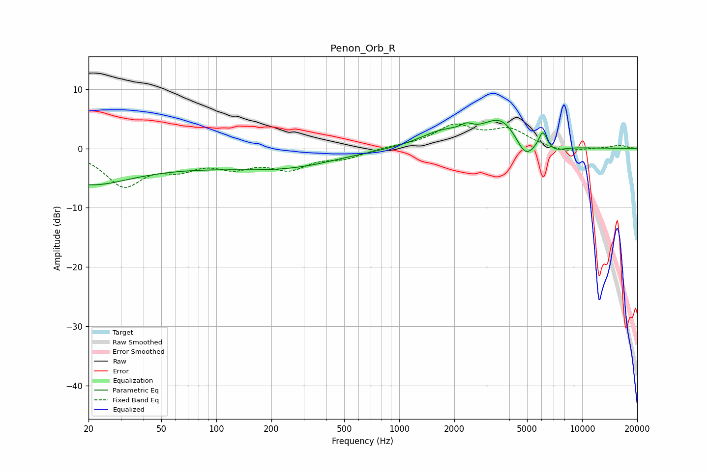

# Penon_Orb_R
See [usage instructions](https://github.com/jaakkopasanen/AutoEq#usage) for more options and info.

### Parametric EQs
Apply preamp of -4.8 dB when using parametric equalizer.

|   # | Type    |   Fc (Hz) |    Q |   Gain (dB) |
|-----|---------|-----------|------|-------------|
|   1 | Peaking |        20 | 0.68 |        -3.3 |
|   2 | Peaking |        37 | 0.18 |        -2.9 |
|   3 | Peaking |       263 | 0.53 |        -2.1 |
|   4 | Peaking |       344 | 4.53 |        -0   |
|   5 | Peaking |      1718 | 1.12 |         2.5 |
|   6 | Peaking |      2334 | 4.12 |         1.1 |
|   7 | Peaking |      3613 | 1.37 |         4.9 |
|   8 | Peaking |      4880 | 2.69 |        -3.5 |
|   9 | Peaking |      6105 | 6    |         3   |
|  10 | Peaking |      7008 | 2.42 |        -0.9 |

### Fixed Band EQs
When using fixed band (also called graphic) equalizer, apply preamp of **-4.2 dB** (if available) and set gains manually with these parameters.

|   # | Type    |   Fc (Hz) |    Q |   Gain (dB) |
|-----|---------|-----------|------|-------------|
|   1 | Peaking |        31 | 1.41 |        -6   |
|   2 | Peaking |        62 | 1.41 |        -2.6 |
|   3 | Peaking |       125 | 1.41 |        -2.6 |
|   4 | Peaking |       250 | 1.41 |        -3   |
|   5 | Peaking |       500 | 1.41 |        -1.4 |
|   6 | Peaking |      1000 | 1.41 |         0.3 |
|   7 | Peaking |      2000 | 1.41 |         3.6 |
|   8 | Peaking |      4000 | 1.41 |         3   |
|   9 | Peaking |      8000 | 1.41 |        -0.8 |
|  10 | Peaking |     16000 | 1.41 |         0.5 |

### Graphs

