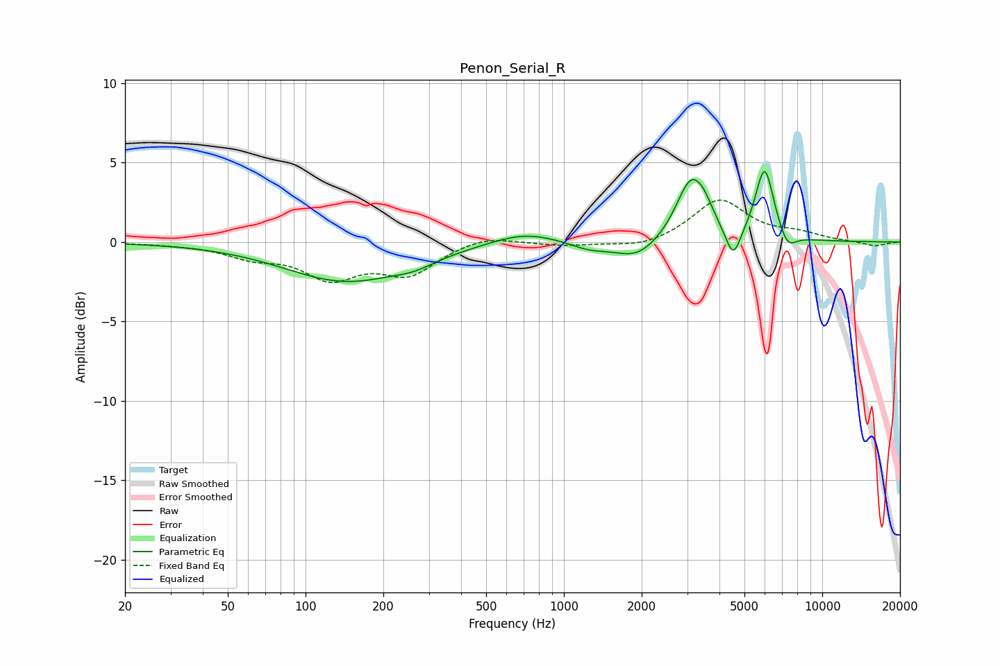

# Penon_Serial_R
See [usage instructions](https://github.com/jaakkopasanen/AutoEq#usage) for more options and info.

### Parametric EQs
Apply preamp of -4.5 dB when using parametric equalizer.

|   # | Type    |   Fc (Hz) |    Q |   Gain (dB) |
|-----|---------|-----------|------|-------------|
|   1 | Peaking |       144 | 0.6  |        -2.4 |
|   2 | Peaking |       265 | 1.82 |        -0.4 |
|   3 | Peaking |       703 | 1.09 |         0.8 |
|   4 | Peaking |      1255 | 1.85 |        -0.5 |
|   5 | Peaking |      1922 | 1.66 |        -1.2 |
|   6 | Peaking |      3101 | 2.42 |         3.8 |
|   7 | Peaking |      3494 | 3.89 |         0.8 |
|   8 | Peaking |      4523 | 4.79 |        -2   |
|   9 | Peaking |      5984 | 3.82 |         4.6 |
|  10 | Peaking |      7338 | 4.13 |        -1   |

### Fixed Band EQs
When using fixed band (also called graphic) equalizer, apply preamp of **-2.7 dB** (if available) and set gains manually with these parameters.

|   # | Type    |   Fc (Hz) |    Q |   Gain (dB) |
|-----|---------|-----------|------|-------------|
|   1 | Peaking |        31 | 1.41 |        -0.1 |
|   2 | Peaking |        62 | 1.41 |        -0.8 |
|   3 | Peaking |       125 | 1.41 |        -2.1 |
|   4 | Peaking |       250 | 1.41 |        -1.9 |
|   5 | Peaking |       500 | 1.41 |         0.5 |
|   6 | Peaking |      1000 | 1.41 |        -0.2 |
|   7 | Peaking |      2000 | 1.41 |        -0.4 |
|   8 | Peaking |      4000 | 1.41 |         2.7 |
|   9 | Peaking |      8000 | 1.41 |         0.4 |
|  10 | Peaking |     16000 | 1.41 |        -0.3 |

### Graphs

