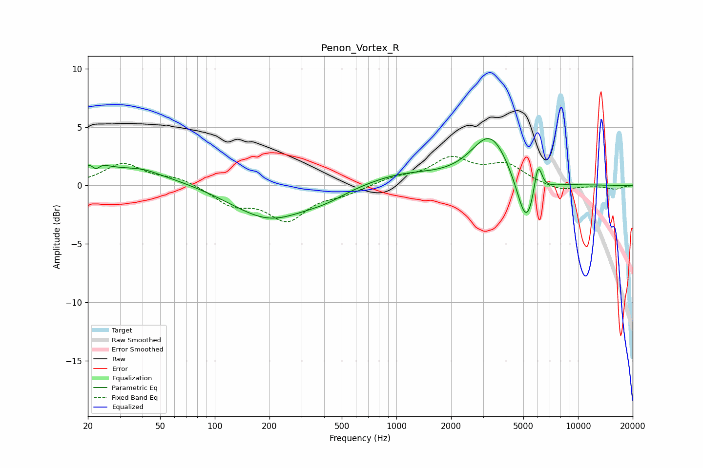

# Penon_Vortex_R
See [usage instructions](https://github.com/jaakkopasanen/AutoEq#usage) for more options and info.

### Parametric EQs
Apply preamp of -4.1 dB when using parametric equalizer.

|   # | Type    |   Fc (Hz) |    Q |   Gain (dB) |
|-----|---------|-----------|------|-------------|
|   1 | Peaking |        22 | 2.95 |         1.3 |
|   2 | Peaking |        22 | 5.97 |        -1   |
|   3 | Peaking |        32 | 0.53 |         1.4 |
|   4 | Peaking |        40 | 1.99 |         0.2 |
|   5 | Peaking |       200 | 0.69 |        -2.9 |
|   6 | Peaking |       406 | 1.23 |        -0.6 |
|   7 | Peaking |      1073 | 0.68 |         1   |
|   8 | Peaking |      3300 | 1.33 |         4.3 |
|   9 | Peaking |      5205 | 2.61 |        -4.6 |
|  10 | Peaking |      6012 | 6    |         3   |

### Fixed Band EQs
When using fixed band (also called graphic) equalizer, apply preamp of **-2.6 dB** (if available) and set gains manually with these parameters.

|   # | Type    |   Fc (Hz) |    Q |   Gain (dB) |
|-----|---------|-----------|------|-------------|
|   1 | Peaking |        31 | 1.41 |         1.8 |
|   2 | Peaking |        62 | 1.41 |         0.6 |
|   3 | Peaking |       125 | 1.41 |        -1.5 |
|   4 | Peaking |       250 | 1.41 |        -2.8 |
|   5 | Peaking |       500 | 1.41 |        -0.6 |
|   6 | Peaking |      1000 | 1.41 |         0.6 |
|   7 | Peaking |      2000 | 1.41 |         2.2 |
|   8 | Peaking |      4000 | 1.41 |         1.6 |
|   9 | Peaking |      8000 | 1.41 |        -0.5 |
|  10 | Peaking |     16000 | 1.41 |        -0.3 |

### Graphs

