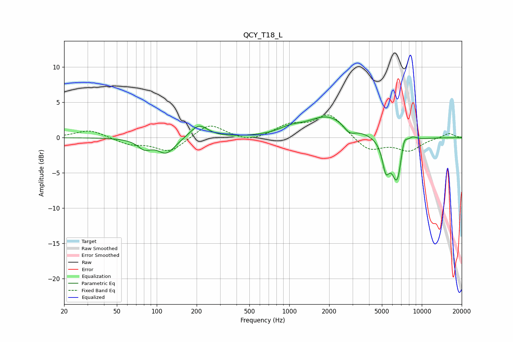

# QCY_T18_L
See [usage instructions](https://github.com/jaakkopasanen/AutoEq#usage) for more options and info.

### Parametric EQs
Apply preamp of -3.0 dB when using parametric equalizer.

|   # | Type    |   Fc (Hz) |    Q |   Gain (dB) |
|-----|---------|-----------|------|-------------|
|   1 | Peaking |        81 | 2.82 |        -1.3 |
|   2 | Peaking |       118 | 2.1  |        -2.2 |
|   3 | Peaking |       208 | 2.14 |         1.9 |
|   4 | Peaking |      1011 | 1.77 |         0.7 |
|   5 | Peaking |      1965 | 0.88 |         3   |
|   6 | Peaking |      2846 | 3.22 |        -1.2 |
|   7 | Peaking |      5355 | 5.19 |        -3.7 |
|   8 | Peaking |      6534 | 3.17 |        -6.8 |
|   9 | Peaking |      7295 | 4.93 |         2.9 |
|  10 | Peaking |      8459 | 3.68 |         0.8 |

### Fixed Band EQs
When using fixed band (also called graphic) equalizer, apply preamp of **-3.3 dB** (if available) and set gains manually with these parameters.

|   # | Type    |   Fc (Hz) |    Q |   Gain (dB) |
|-----|---------|-----------|------|-------------|
|   1 | Peaking |        31 | 1.41 |         1.1 |
|   2 | Peaking |        62 | 1.41 |        -0.9 |
|   3 | Peaking |       125 | 1.41 |        -2.1 |
|   4 | Peaking |       250 | 1.41 |         2.1 |
|   5 | Peaking |       500 | 1.41 |        -0.7 |
|   6 | Peaking |      1000 | 1.41 |         1.6 |
|   7 | Peaking |      2000 | 1.41 |         3.3 |
|   8 | Peaking |      4000 | 1.41 |        -2   |
|   9 | Peaking |      8000 | 1.41 |        -1.8 |
|  10 | Peaking |     16000 | 1.41 |         0.7 |

### Graphs

