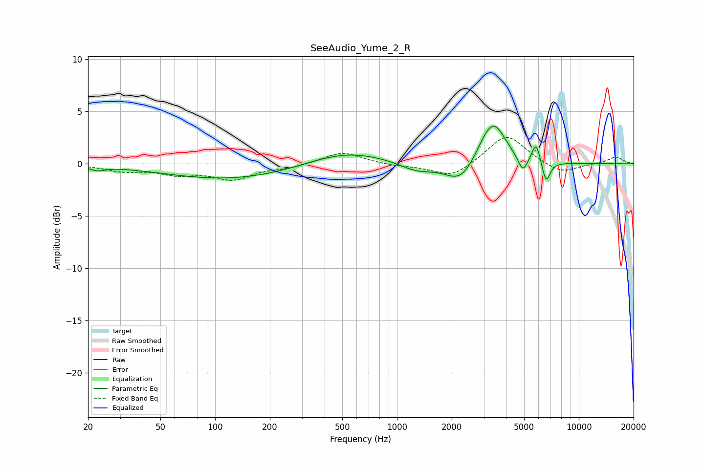

# SeeAudio_Yume_2_R
See [usage instructions](https://github.com/jaakkopasanen/AutoEq#usage) for more options and info.

### Parametric EQs
Apply preamp of -3.7 dB when using parametric equalizer.

|   # | Type    |   Fc (Hz) |    Q |   Gain (dB) |
|-----|---------|-----------|------|-------------|
|   1 | Peaking |        23 | 3.61 |        -0.4 |
|   2 | Peaking |       123 | 0.38 |        -1.5 |
|   3 | Peaking |       519 | 0.64 |         1.4 |
|   4 | Peaking |      1280 | 1.49 |        -0.8 |
|   5 | Peaking |      2244 | 1.69 |        -2.1 |
|   6 | Peaking |      3019 | 2.22 |         0.9 |
|   7 | Peaking |      3416 | 2.12 |         3.6 |
|   8 | Peaking |      4918 | 5.55 |        -1.5 |
|   9 | Peaking |      5821 | 6    |         2   |
|  10 | Peaking |      6606 | 6    |        -2.1 |

### Fixed Band EQs
When using fixed band (also called graphic) equalizer, apply preamp of **-2.6 dB** (if available) and set gains manually with these parameters.

|   # | Type    |   Fc (Hz) |    Q |   Gain (dB) |
|-----|---------|-----------|------|-------------|
|   1 | Peaking |        31 | 1.41 |        -0.6 |
|   2 | Peaking |        62 | 1.41 |        -0.9 |
|   3 | Peaking |       125 | 1.41 |        -1.4 |
|   4 | Peaking |       250 | 1.41 |        -0.3 |
|   5 | Peaking |       500 | 1.41 |         1.2 |
|   6 | Peaking |      1000 | 1.41 |        -0.2 |
|   7 | Peaking |      2000 | 1.41 |        -1.4 |
|   8 | Peaking |      4000 | 1.41 |         2.9 |
|   9 | Peaking |      8000 | 1.41 |        -1   |
|  10 | Peaking |     16000 | 1.41 |         0.7 |

### Graphs

